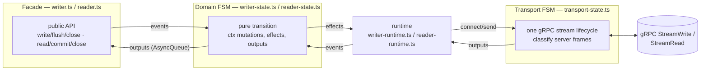
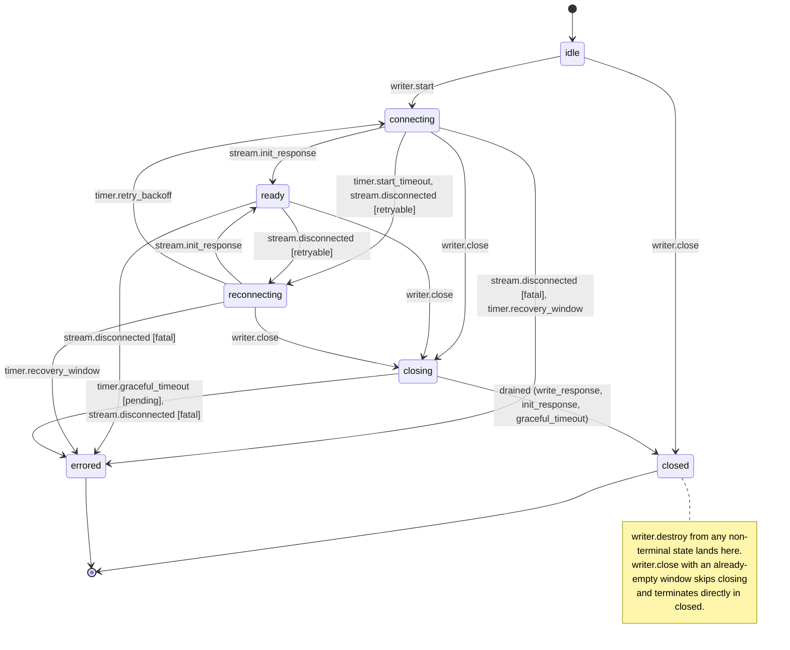
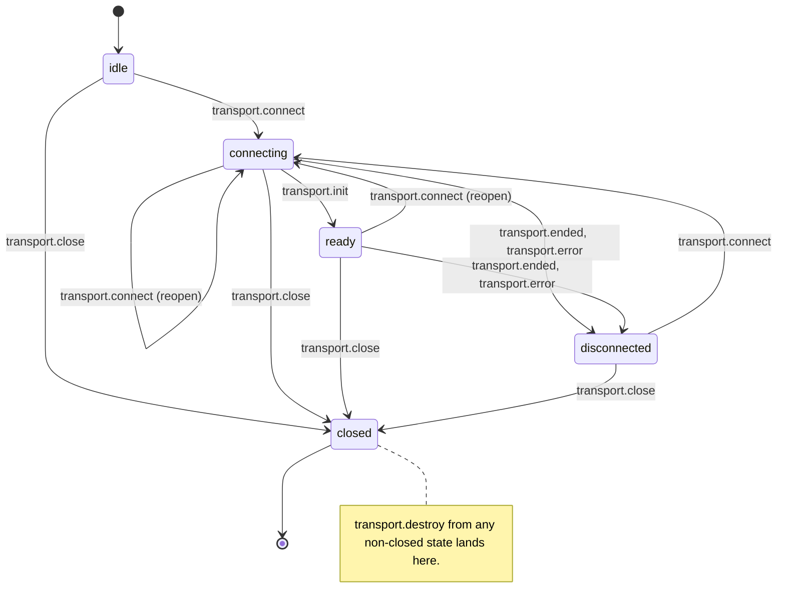
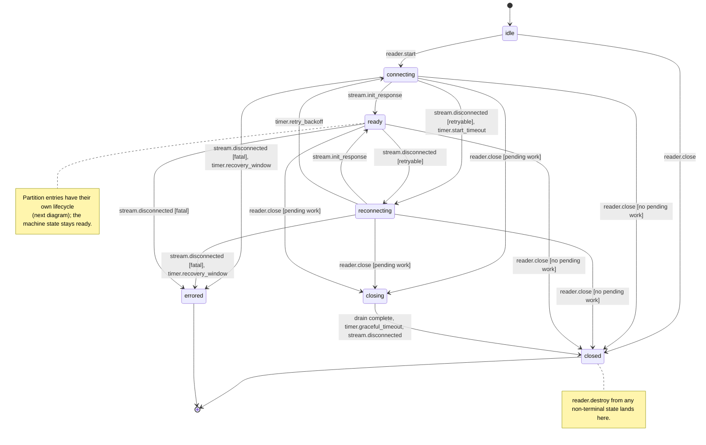

# @ydbjs/topic — state machine maps

Contributor documentation. The reader and writer are each built from two finite state
machines on top of `@ydbjs/fsm`, plus a thin public facade. This file is the map of
every machine: states, transitions, timers, and the invariants the design rests on.

The transition tables below mirror the exhaustive `switch` dispatch in the `*-state.ts`
files one-to-one — every `(state, event)` pair is either a table row or falls into the
`(everything else)` row. **When you change a dispatch, update the matching table and
diagram in the same commit.**

## The two-FSM pipeline

- The **domain FSM** is pure and synchronous: it mutates `ctx` in place and returns the
  next state plus a list of effects. All I/O lives in the **runtime**, which executes
  effects (connect, send, timers) and feeds results back as events.
- The **transport FSM** owns exactly one physical stream at a time: it classifies raw
  server frames into typed facts and reports stream life/death. Reconnect policy lives
  in the domain FSM, never in the transport.
- Outputs flow to the facade through an `AsyncQueue` with drain-then-throw semantics:
  on a fatal error the queue delivers already-emitted facts (acks, commit confirmations)
  first, then throws the reason.
- Convention: the domain FSMs log deliberately-ignored `(state, event)` pairs via
  `ignored()`; the transport FSMs drop unhandled events silently — they are pure
  classifiers, and every meaningful fact already has an explicit case.

---

## Writer FSM (`writer-state.ts`)

- `idle` — created, not started; accepts writes into the buffer before connecting
- `connecting` — one stream attempt in flight, `start_timeout` watchdog armed
- `ready` — live session; pumps buffer → inflight, handles acks/token
- `reconnecting` — backing off between attempts (`retry_backoff` armed; `recovery_window` armed only if `recoveryWindowMs` is finite)
- `closing` — graceful drain gate, bounded by `graceful_timeout`; keeps reconnecting to finish the drain
- `closed` — graceful/destroyed terminal (final)
- `errored` — fatal terminal (final)

Helper resolution: `toReady` → `ready`; `toReconnecting` → `reconnecting`; `toClosing` →
`closing` (or straight to `closed` via `closeWhenDrained` if the window is already
empty); `terminate(s)` → `s` with `final:{reason}`, emits `writer.closed` (plus
`writer.error` when `errored`), frees the message window, effects `[transport.close,
finalize]`. `pump` keeps the state — effect `send.write_request(batch)` when sendable,
self-dispatches `writer.pump` while more can be sent. `connectEffects` =
`[transport.connect(getLastSeqNo=!hasEverConnected), schedule start_timeout]`.

| state            | event                                              | → next                  | key effects / outputs / timers                                                                                                                                                                                                                                                                              |
| ---------------- | -------------------------------------------------- | ----------------------- | ----------------------------------------------------------------------------------------------------------------------------------------------------------------------------------------------------------------------------------------------------------------------------------------------------------- |
| any non-terminal | `writer.destroy`                                   | closed                  | terminate: emit `writer.closed{reason ?? 'Writer destroyed'}`; release window                                                                                                                                                                                                                               |
| idle             | `writer.start`                                     | connecting              | `transport.connect(getLastSeqNo=true)`, schedule `start_timeout`                                                                                                                                                                                                                                            |
| idle             | `writer.write`                                     | same                    | enqueue (infers seqNoMode on first message; manual seqNo raises `lastSeqNo` HWM)                                                                                                                                                                                                                            |
| idle             | `writer.close`                                     | closed                  | terminate('Writer closed before start')                                                                                                                                                                                                                                                                     |
| idle             | (everything else)                                  | same                    | ignored (logged)                                                                                                                                                                                                                                                                                            |
| connecting       | `writer.write`                                     | same                    | enqueue                                                                                                                                                                                                                                                                                                     |
| connecting       | `writer.flush`                                     | same                    | set `flushRequested`; emit `writer.flushed` if window empty                                                                                                                                                                                                                                                 |
| connecting       | `writer.stream.init_response`                      | ready                   | toReady: `attempts=0`; applyInit (recover seqNo HWM once, dedup server-persisted inflight → emit `writer.acknowledgments{skipped}`; emit `writer.session`); resolve flush if drained; dispatch `writer.pump`; clear `start_timeout`/`retry_backoff`/`recovery_window`; schedule `flush_tick`+`update_token` |
| connecting       | `writer.timer.start_timeout`                       | reconnecting            | toReconnecting(no error)                                                                                                                                                                                                                                                                                    |
| connecting       | `writer.stream.disconnected` [retryable]           | reconnecting            | toReconnecting(error): record `lastError`; emit `writer.reconnecting{attempt,error}`; schedule `retry_backoff` (+`recovery_window` if finite)                                                                                                                                                               |
| connecting       | `writer.stream.disconnected` [fatal]               | errored                 | terminate(error): emit `writer.error`+`writer.closed`                                                                                                                                                                                                                                                       |
| connecting       | `writer.timer.recovery_window`                     | errored                 | terminate(`lastError ?? 'Writer recovery window expired'`)                                                                                                                                                                                                                                                  |
| connecting       | `writer.close`                                     | closing / closed        | toClosing: dispatch `writer.pump`; schedule `graceful_timeout` (start_timeout/retry_backoff left armed)                                                                                                                                                                                                     |
| connecting       | (everything else)                                  | same                    | ignored (logged)                                                                                                                                                                                                                                                                                            |
| ready            | `writer.write`                                     | same                    | enqueue; dispatch `writer.pump`                                                                                                                                                                                                                                                                             |
| ready            | `writer.pump` / `writer.timer.flush_tick`          | same                    | pump: form batch (buffer→inflight, assign auto seqNos); `send.write_request`; re-dispatch while sendable                                                                                                                                                                                                    |
| ready            | `writer.stream.write_response`                     | same                    | acknowledge acked prefix → emit `writer.acknowledgments{freedBytes}`; emit `writer.flushed` if flush pending and drained; dispatch `writer.pump`                                                                                                                                                            |
| ready            | `writer.flush`                                     | same                    | requestFlush (emit `writer.flushed` if drained, else dispatch `writer.pump`)                                                                                                                                                                                                                                |
| ready            | `writer.timer.update_token`                        | same                    | `send.update_token`                                                                                                                                                                                                                                                                                         |
| ready            | `writer.stream.token_response`                     | same                    | consumed, no-op                                                                                                                                                                                                                                                                                             |
| ready            | `writer.stream.disconnected` [retryable]           | reconnecting            | toReconnecting(error)                                                                                                                                                                                                                                                                                       |
| ready            | `writer.stream.disconnected` [fatal]               | errored                 | terminate(error)                                                                                                                                                                                                                                                                                            |
| ready            | `writer.close`                                     | closing / closed        | toClosing                                                                                                                                                                                                                                                                                                   |
| ready            | (everything else)                                  | same                    | ignored (logged)                                                                                                                                                                                                                                                                                            |
| reconnecting     | `writer.write`                                     | same                    | enqueue                                                                                                                                                                                                                                                                                                     |
| reconnecting     | `writer.flush`                                     | same                    | requestFlush                                                                                                                                                                                                                                                                                                |
| reconnecting     | `writer.stream.init_response`                      | ready                   | toReady (late init from a still-open stream is honored)                                                                                                                                                                                                                                                     |
| reconnecting     | `writer.timer.retry_backoff`                       | connecting              | `attempts += 1`; connectEffects                                                                                                                                                                                                                                                                             |
| reconnecting     | `writer.timer.recovery_window`                     | errored                 | terminate(`lastError ?? 'Writer recovery window expired'`)                                                                                                                                                                                                                                                  |
| reconnecting     | `writer.stream.disconnected`                       | same                    | record `lastError` if present; stay (already backing off)                                                                                                                                                                                                                                                   |
| reconnecting     | `writer.close`                                     | closing / closed        | toClosing                                                                                                                                                                                                                                                                                                   |
| reconnecting     | (everything else)                                  | same                    | ignored (logged)                                                                                                                                                                                                                                                                                            |
| closing          | `writer.stream.write_response`                     | closed [drained] / same | acknowledge → emits as in ready; closeWhenDrained: terminate('Writer closed') when window empty, else dispatch `writer.pump`                                                                                                                                                                                |
| closing          | `writer.pump` / `flush_tick` [`!hasEverConnected`] | same                    | no-op guard: never assign auto seqNos before the HWM is recovered (prevents dedup data loss when close() races the first init)                                                                                                                                                                              |
| closing          | `writer.pump` / `flush_tick` [`hasEverConnected`]  | same                    | pump                                                                                                                                                                                                                                                                                                        |
| closing          | `writer.flush`                                     | same                    | requestFlush                                                                                                                                                                                                                                                                                                |
| closing          | `writer.stream.init_response`                      | closed [drained] / same | applyInit; resolve flush; closeWhenDrained; clear `start_timeout`                                                                                                                                                                                                                                           |
| closing          | `writer.timer.retry_backoff`                       | same                    | connectEffects — keeps draining over a fresh stream                                                                                                                                                                                                                                                         |
| closing          | `writer.timer.graceful_timeout` [not drained]      | errored                 | terminate('Graceful shutdown timed out with undelivered messages') — close() rejects instead of dropping writes                                                                                                                                                                                             |
| closing          | `writer.timer.graceful_timeout` [drained]          | closed                  | closeWhenDrained → terminate('Writer closed')                                                                                                                                                                                                                                                               |
| closing          | `writer.timer.start_timeout`                       | same                    | clear `start_timeout`, schedule `retry_backoff`                                                                                                                                                                                                                                                             |
| closing          | `writer.stream.disconnected` [retryable]           | same                    | clear `start_timeout`, schedule `retry_backoff`                                                                                                                                                                                                                                                             |
| closing          | `writer.stream.disconnected` [fatal]               | errored                 | terminate(error)                                                                                                                                                                                                                                                                                            |
| closing          | (everything else)                                  | same                    | ignored (logged)                                                                                                                                                                                                                                                                                            |
| closed / errored | (everything, incl. `writer.destroy`)               | same                    | ignored (logged)                                                                                                                                                                                                                                                                                            |

Retryable classification (`isRetryableWriterError`): a clean end (no error) is
retryable; payload-too-large (`ClientError RESOURCE_EXHAUSTED` + `/larger than/i`) is
always fatal; `SCHEME_ERROR` is retryable only with `retryOnSchemeError`; otherwise
`isRetryableStreamError || isRetryableError(err, idempotent=true)` — writes are
idempotent (producerId+seqNo dedup), so the conditionally-retryable YDB statuses retry.

## Writer transport FSM (`writer/transport-state.ts`)

- `idle` — created, no stream yet
- `connecting` — `open_stream` issued, awaiting init (one physical streamWrite lifecycle)
- `ready` — init seen; forwarding classified stream facts as outputs
- `disconnected` — stream ended/errored; awaiting `transport.connect` (reopen) or `transport.close`
- `closed` — terminal (final)

| state              | event                                 | → next       | key effects / outputs                                                   |
| ------------------ | ------------------------------------- | ------------ | ----------------------------------------------------------------------- |
| any non-closed     | `transport.destroy`                   | closed       | `close_stream`, `finalize(reason ?? 'Transport destroyed')`             |
| idle               | `transport.connect`                   | connecting   | `open_stream`                                                           |
| idle               | `transport.close`                     | closed       | `finalize('Transport closed')` (nothing open — no `close_stream`)       |
| connecting / ready | `transport.connect`                   | connecting   | `open_stream` (reopen; disposes the previous stream first)              |
| connecting / ready | `transport.init`                      | ready / same | emit `transport.stream.init_response{sessionId,lastSeqNo,partitionId?}` |
| connecting / ready | `transport.write`                     | same         | emit `transport.stream.write_response{acks}`                            |
| connecting / ready | `transport.token`                     | same         | emit `transport.stream.token_response`                                  |
| connecting / ready | `transport.ended` / `transport.error` | disconnected | emit `transport.stream.disconnected{error?}`; `close_stream`            |
| connecting / ready | `transport.close`                     | closed       | `close_stream`, `finalize('Transport closed')`                          |
| disconnected       | `transport.connect`                   | connecting   | `open_stream`                                                           |
| disconnected       | `transport.close`                     | closed       | `finalize('Transport closed')`                                          |
| any                | (everything else)                     | same         | silently dropped (pure classifier)                                      |

---

## Reader FSM (`reader-state.ts`)

- `idle` — initial; only `reader.start` / `reader.close` are meaningful
- `connecting` — stream being opened; `start_timeout` armed
- `ready` — live stream. No seqNo recovery (unlike the writer) — the server re-sends `start_partition` per partition, and commit reconcile happens there
- `reconnecting` — backoff between attempts; `retry_backoff` armed, `recovery_window` only when finite
- `closing` — `close()` drain of pending work (pending commits / stopping-graceful partitions), bounded by `graceful_timeout`
- `closed` — terminal (clean close or destroy)
- `errored` — terminal (non-retryable stream error or recovery-window expiry)

Per-partition entry lifecycle (inside `ctx.partitions`, keyed by the **stable**
`partitionId`; the ephemeral `partitionSessionId` mapping lives in `ctx.sessionIndex`
and is cleared on every reconnect):

```mermaid
stateDiagram-v2
    [*] --> active: stream.start_partition (grantId++, ackPending)
    active --> active: partition.start_ready → send start_response,\nre-send buffered commits (ackPending=false)
    active --> stopping_graceful: stop_partition [graceful, pending commits]
    active --> stopped: stop_partition [force or graceful+drained]
    stopping_graceful --> stopped: commit_response [drained] → send stop_response
    stopping_graceful --> stopped: timer.partition_graceful_timeout (force)
    active --> ended: stream.end_partition (kept for commit reconcile)
    stopped --> active: stream.start_partition (re-grant; anchor kept)
    ended --> active: stream.start_partition
    stopped --> [*]: timer.partition_reassign_gc\n(reject pending commits, delete entry)
```

Helper resolution: `terminate(s, reason)` → `s` with `final:{reason}`; emits
`reader.error` (when `errored`), `reader.commit.rejected` for every pending commit,
`reader.closed`; clears ctx; effects `transport.close`, clear all timers, `finalize`.
`toReady` → `ready`: `attempts=0`, clear `sessionIndex`, reset flow-control; emits
`reader.session`; schedules `update_token`, sends `read_request(maxBufferBytes)`, and
arms `partition_reassign_gc:pid` for every partition holding pending commits.
`toReconnecting(err)` → `reconnecting`: clear `sessionIndex`; emits
`reader.reconnecting`; schedules `retry_backoff` (+`recovery_window` iff finite).
`toClosing` → `closing` iff pending work exists, else terminate(closed, 'Reader closed').

| state                     | event                                                                                               | → next                  | key effects / outputs / timers                                                                                                                                                                                                                                                                                     |
| ------------------------- | --------------------------------------------------------------------------------------------------- | ----------------------- | ------------------------------------------------------------------------------------------------------------------------------------------------------------------------------------------------------------------------------------------------------------------------------------------------------------------ |
| any non-terminal          | `reader.destroy`                                                                                    | closed                  | terminate(closed, `reason ?? 'Reader destroyed'`)                                                                                                                                                                                                                                                                  |
| idle                      | `reader.start`                                                                                      | connecting              | `transport.connect`, schedule `start_timeout`                                                                                                                                                                                                                                                                      |
| idle                      | `reader.close`                                                                                      | closed                  | terminate(closed, 'Reader closed before start')                                                                                                                                                                                                                                                                    |
| idle                      | (everything else)                                                                                   | same                    | ignored (logged)                                                                                                                                                                                                                                                                                                   |
| connecting / reconnecting | `reader.stream.init_response`                                                                       | ready                   | toReady                                                                                                                                                                                                                                                                                                            |
| connecting / reconnecting | `reader.commit`                                                                                     | same                    | recordCommit: buffer only (never sends outside ready); `commit.rejected` if partition unknown, `commit.resolved` if ranges already covered                                                                                                                                                                         |
| connecting / reconnecting | `reader.stream.disconnected` [fatal]                                                                | errored                 | terminate(errored, error)                                                                                                                                                                                                                                                                                          |
| connecting / reconnecting | `reader.stream.disconnected` [retryable], `timer.start_timeout`                                     | reconnecting            | toReconnecting                                                                                                                                                                                                                                                                                                     |
| connecting / reconnecting | `timer.retry_backoff` [state==reconnecting]                                                         | connecting              | `attempts+=1`; `transport.connect`, schedule `start_timeout`                                                                                                                                                                                                                                                       |
| connecting / reconnecting | `timer.retry_backoff` [state==connecting]                                                           | same                    | ignored (stale backoff, logged)                                                                                                                                                                                                                                                                                    |
| connecting / reconnecting | `timer.recovery_window`                                                                             | errored                 | terminate(errored, `lastError ?? 'Reader recovery window expired'`)                                                                                                                                                                                                                                                |
| connecting / reconnecting | `timer.partition_graceful_timeout`                                                                  | same                    | forceStopStalledGraceful: entry→`stopped`, emit `partition.stopped(graceful)`; `stop_response` only if the session id belongs to the current stream; arm `partition_reassign_gc:pid` if pendings remain                                                                                                            |
| connecting / reconnecting | `timer.partition_reassign_gc`                                                                       | same                    | gcPartition: reject pending commits, delete entry unless it is a granted-but-unacked current grant; no-op if live+acked                                                                                                                                                                                            |
| connecting / reconnecting | `reader.close`                                                                                      | closing / closed        | toClosing                                                                                                                                                                                                                                                                                                          |
| connecting / reconnecting | (everything else)                                                                                   | same                    | ignored (logged)                                                                                                                                                                                                                                                                                                   |
| ready                     | `reader.stream.read_response`                                                                       | same                    | charge `inFlightBytes += bytesSize`; emit one `reader.messages{releaseBytes, groups}` (drops data of unknown/superseded/stopped/ended entries; emitted even when all dropped so the credit is released)                                                                                                            |
| ready                     | `reader.stream.start_partition`                                                                     | same                    | upsert entry: →`active`, new `grantId`, `ackPending=true`, fresh session id (old id dropped from index), anchor never rewound below `committedOffset`; clear `partition_graceful_timeout:pid`; drain covered commits; emit `partition.started`; effect `partition.start_hook` (response deferred to `start_ready`) |
| ready                     | `reader.stream.stop_partition` [force]                                                              | same                    | resolve covered commits; entry→`stopped`, emit `partition.stopped(lost)`; arm `partition_reassign_gc:pid` if pendings remain                                                                                                                                                                                       |
| ready                     | `reader.stream.stop_partition` [graceful, drained]                                                  | same                    | entry→`stopped`, emit `partition.stopped(graceful)`; send `stop_response`                                                                                                                                                                                                                                          |
| ready                     | `reader.stream.stop_partition` [graceful, pendings]                                                 | same                    | entry→`stopping-graceful`; arm `partition_graceful_timeout:pid`                                                                                                                                                                                                                                                    |
| ready                     | `reader.stream.commit_response`                                                                     | same                    | advance committed offsets; emit `partition.committed` + `commit.resolved` for drained waiters; a drained `stopping-graceful` entry →`stopped`: emit `partition.stopped(graceful)`, send `stop_response`, clear `partition_graceful_timeout:pid`                                                                    |
| ready                     | `reader.stream.end_partition`                                                                       | same                    | entry→`ended`, emit `partition.stopped(ended)`; no response; entry kept for commit reconcile                                                                                                                                                                                                                       |
| ready                     | `reader.commit`                                                                                     | same                    | recordCommit: buffer pending; `send.commit` only if the session is live on the current stream AND entry is `active`/`stopping-graceful`/`ended` AND `!ackPending`; immediate `commit.rejected` (no entry) / `commit.resolved` (all offsets below the anchor)                                                       |
| ready                     | `reader.partition.start_ready`                                                                      | same                    | ackPartitionStart: no-op if grantId stale / not ackPending / not active / not indexed; else `ackPending=false`, reconcile `commitOffset` override, effects `send.start_response`, clear `partition_reassign_gc:pid`, send all buffered commits (the single send)                                                   |
| ready                     | `reader.read_release`                                                                               | same                    | `inFlightBytes -= bytes`; accumulate credit; `read_request(credit)` once ≥ ceil(maxBufferBytes/5)                                                                                                                                                                                                                  |
| ready                     | `timer.update_token`                                                                                | same                    | `send.update_token`                                                                                                                                                                                                                                                                                                |
| ready                     | `timer.partition_reassign_gc` / `timer.partition_graceful_timeout`                                  | same                    | gcPartition / forceStopStalledGraceful (as above)                                                                                                                                                                                                                                                                  |
| ready                     | `reader.stream.disconnected` [fatal]                                                                | errored                 | terminate(errored, error)                                                                                                                                                                                                                                                                                          |
| ready                     | `reader.stream.disconnected` [retryable]                                                            | reconnecting            | toReconnecting(error)                                                                                                                                                                                                                                                                                              |
| ready                     | `reader.close`                                                                                      | closing / closed        | toClosing                                                                                                                                                                                                                                                                                                          |
| ready                     | (everything else)                                                                                   | same                    | ignored (logged)                                                                                                                                                                                                                                                                                                   |
| closing                   | `stream.read_response` / `start_partition` / `stop_partition` / `commit_response` / `end_partition` | closed [drained] / same | applyStreamEvent (same per-event handling as in ready); then terminate(closed, 'Reader closed') once no pending work                                                                                                                                                                                               |
| closing                   | `reader.partition.start_ready`                                                                      | same                    | ackPartitionStart (a start honored during the drain still gets answered)                                                                                                                                                                                                                                           |
| closing                   | `timer.partition_graceful_timeout`                                                                  | closed [drained] / same | forceStopStalledGraceful; terminate once drained                                                                                                                                                                                                                                                                   |
| closing                   | `timer.graceful_timeout`                                                                            | closed                  | terminate(closed, 'Reader closed')                                                                                                                                                                                                                                                                                 |
| closing                   | `reader.stream.disconnected`                                                                        | closed                  | terminate(closed, 'Reader closed') — a drop mid-close abandons un-acked commits                                                                                                                                                                                                                                    |
| closing                   | `timer.partition_reassign_gc`                                                                       | closed [drained] / same | gcPartition; terminate once drained                                                                                                                                                                                                                                                                                |
| closing                   | (everything else)                                                                                   | same                    | ignored (logged)                                                                                                                                                                                                                                                                                                   |
| closed / errored          | (everything, incl. `reader.destroy`)                                                                | same                    | ignored (logged)                                                                                                                                                                                                                                                                                                   |

## Reader transport FSM (`reader/transport-state.ts`)

Same five states as the writer transport. The only structural difference: after init,
every other server frame is forwarded verbatim as `transport.stream.message` — the
protobuf → domain classification happens in `reader-runtime.ts` (`classifyServerMessage`),
so the reader FSM never touches `serverMessage.case`.

| state              | event                                 | → next       | key effects / outputs                                        |
| ------------------ | ------------------------------------- | ------------ | ------------------------------------------------------------ |
| any non-closed     | `transport.destroy`                   | closed       | `close_stream`, `finalize(reason ?? 'Transport destroyed')`  |
| idle               | `transport.connect`                   | connecting   | `open_stream`                                                |
| idle               | `transport.close`                     | closed       | `finalize('Transport closed')`                               |
| connecting / ready | `transport.connect`                   | connecting   | `open_stream` (reopen)                                       |
| connecting / ready | `transport.init`                      | ready / same | emit `transport.stream.init_response{sessionId}`             |
| connecting / ready | `transport.message`                   | same         | emit `transport.stream.message{message}` (verbatim forward)  |
| connecting / ready | `transport.ended` / `transport.error` | disconnected | emit `transport.stream.disconnected{error?}`; `close_stream` |
| connecting / ready | `transport.close`                     | closed       | `close_stream`, `finalize('Transport closed')`               |
| disconnected       | `transport.connect`                   | connecting   | `open_stream`                                                |
| disconnected       | `transport.close`                     | closed       | `finalize('Transport closed')`                               |
| any                | (everything else)                     | same         | silently dropped (pure classifier)                           |

---

## Invariants the maps rest on

1. **seqNo is assigned at send time** (writer, auto mode). Buffered messages carry
   `seqNo=0n` and get numbered in `pump`'s `formBatch` — so a reconnect never renumbers,
   and the `closing` pump gate (`hasEverConnected`) guarantees no auto seqNo is ever
   assigned before the server's high-water mark is recovered.
   Pinned by: writer-state tests, `writer-protocol.test.ts` (live dedup proof).
2. **commit() is never rejected by a transparent reconnect** (reader). Pending commits
   are buffered per partition and re-sent after the start handshake on the new session.
   The only legal rejection paths are the `partition_reassign_gc` timer and terminal
   shutdown. Pinned by: `reader.model.test.ts` (800-seed invariant).
3. **Grant epoch** (`grantId` + `ackPending`): a partition grant is live only after
   `start_ready` → `start_response`; buffered commits are sent exactly once, and stale
   hook completions (session ids restart at 1 per stream) can never double-answer.
   Pinned by: reader-state tests, `reader.contract.test.ts` start-handshake tests.
4. **The gap-fill anchor only moves forward** (`nextCommitStartOffset`, kept on the
   `partitionId`-keyed entry, surviving reconnects). Below-anchor offsets are skipped —
   a zero-width or inverted commit range (session-fatal server-side) is unrepresentable.
   Pinned by: anchor tests in `reader-state.test.ts`, model invariant.
5. **Flow control is charged per ReadResponse** and released only when the facade's
   consumer takes the chunk; credit is re-granted in batches of ≥ maxBufferBytes/5.
6. **Terminal errors throw from the facade, never end streams silently**: the output
   queue drains buffered facts first, then throws (`AsyncQueue.fail`), and every later
   `read()`/`commit()`/`close()` rethrows the same reason.

Cross-checks: the model tests (`*.model.test.ts`) wire these exact transition functions
to a protocol-faithful server model and drive them with 800 random seeds per run; the
contract tests exercise the same maps through the public facade over a fake wire.
