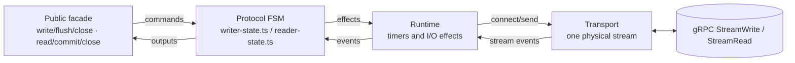
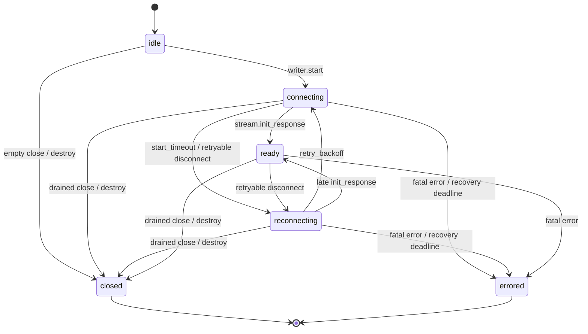
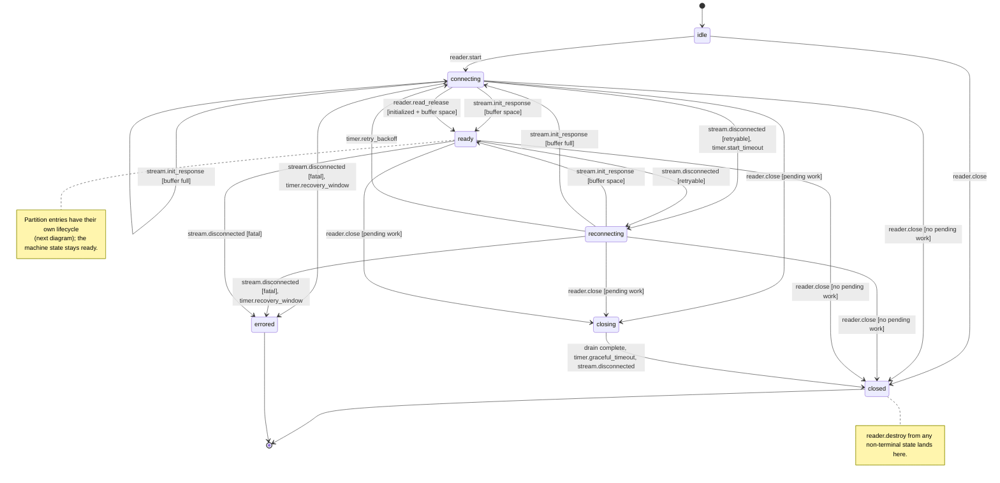
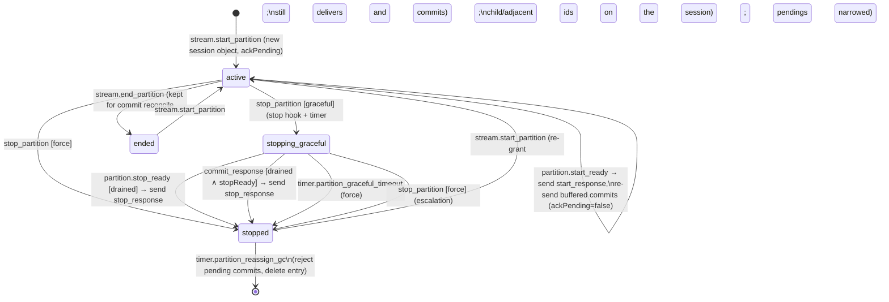

# @ydbjs/topic — state machine maps

The reader and writer each have one protocol state machine, an I/O runtime, a stream transport and a public facade. The transition tables map protocol events to state changes, effects and observable outputs.

## Ownership

```mermaid
flowchart LR
    API[Public facade<br/>write/flush/close · read/commit/close]
    D[Protocol FSM<br/>writer-state.ts / reader-state.ts]
    R[Runtime<br/>timers and I/O effects]
    T[Transport<br/>one physical stream]
    G[(gRPC StreamWrite / StreamRead)]
    API -- commands --> D
    D -- outputs --> API
    D -- effects --> R
    R -- events --> D
    R -- connect/send --> T
    T -- stream events --> R
    T <--> G
```

- The facade validates synchronous API calls and owns application promises, callbacks and delivered messages.
- The protocol FSM owns sequence numbers, partition grants, unconfirmed work and reconnect policy. Transitions mutate their context and return effects; they do not perform I/O.
- The runtime executes effects and feeds timer and transport events into the FSM.
- The transport owns the physical stream and its outgoing queue. It reports received frames and disconnects without keeping a second protocol state machine.
- Machine outputs drain already-emitted facts before a terminal error reaches the facade. A runtime fault also releases timers, transport resources and retained messages.

Update the corresponding transition table when changing a protocol transition.

## Writer FSM (`writer-state.ts`)

The connection has six states: `idle`, `connecting`, `ready`, `reconnecting`, `closed` and `errored`. `closeRequested` records the independent request to drain and close. Closing preserves the current connection phase, so a reconnect still requires InitResponse before any writes are sent.

```mermaid
stateDiagram-v2
    [*] --> idle
    idle --> connecting: writer.start
    connecting --> ready: stream.init_response
    connecting --> reconnecting: start_timeout / retryable disconnect
    reconnecting --> connecting: retry_backoff
    reconnecting --> ready: late init_response
    ready --> reconnecting: retryable disconnect
    connecting --> errored: fatal error / recovery deadline
    reconnecting --> errored: fatal error / recovery deadline
    ready --> errored: fatal error
    idle --> closed: empty close / destroy
    connecting --> closed: drained close / destroy
    reconnecting --> closed: drained close / destroy
    ready --> closed: drained close / destroy
    closed --> [*]
    errored --> [*]
```

`messages` retains accepted, unacknowledged messages in order. `inflightCount` separates the sent prefix from the unsent suffix. Acknowledgments remove a prefix; reconnect removes the server-confirmed prefix and makes the remainder eligible for resend. Automatic sequence numbers are assigned only on sending, after the initial server watermark has been recovered. Manual numbers are validated by the facade and retained unchanged.

The facade counts unacknowledged compressed payload bytes for `maxBufferBytes`. The FSM caches the compressed payload bytes in the unsent suffix for constant-time batch readiness checks. Batching targets 48 MiB of compressed payload; protocol framing and metadata do not reduce this payload budget. Diagnostics report the same compressed payload bytes.

A batch is full when it fills the available `maxInflightCount` slots, reaches the byte cap, or the next queued message cannot fit within that cap. Full batches send immediately. A partial batch waits for `flushIntervalMs`, unless an explicit `flush()` or `close()` requires draining it. `batchDue` records that the timer expired while messages were waiting: if in-flight messages occupy the window, their ACK must release the overdue batch without another timer delay. Resends after reconnect are also immediately eligible once InitResponse arrives.

`pendingFlushId` identifies the latest application flush being drained. `closeRequested` stops admission and keeps reconnecting until all accepted messages are acknowledged. The graceful deadline bounds that drain instead of the normal recovery window. ACK outputs precede flush completion, which precedes terminal close.

| State                            | Event                           | Result                                                                                                                                                              |
| -------------------------------- | ------------------------------- | ------------------------------------------------------------------------------------------------------------------------------------------------------------------- |
| Any live state                   | `writer.destroy`                | Emit closed and release all resources.                                                                                                                              |
| Any live state                   | `writer.close`                  | Record close intent once; close immediately if drained, otherwise arm the graceful deadline and continue the current connection lifecycle.                          |
| Any live state                   | `writer.write`                  | Enqueue while accepting writes; trigger the batch planner when ready. Ignore writes after close intent.                                                             |
| Any live state                   | `writer.flush`                  | Record its ID; complete if drained, otherwise request a pump.                                                                                                       |
| Any live state                   | `writer.timer.flush_tick`       | Mark a waiting batch due; pump only when ready.                                                                                                                     |
| Any live state                   | `writer.timer.graceful_timeout` | If closing, terminate with an error when messages remain; otherwise finish the drain. Ignore when no close was requested.                                           |
| `idle`                           | `writer.start`                  | Connect and arm the start watchdog.                                                                                                                                 |
| `connecting` / `reconnecting`    | `writer.stream.init_response`   | Validate the codec, recover sequence numbers and deduplicate; finish a completed drain or enter ready. Clear connection/recovery timers and arm flush/token timers. |
| `connecting`                     | `writer.timer.start_timeout`    | Enter reconnect backoff.                                                                                                                                            |
| `reconnecting`                   | `writer.timer.retry_backoff`    | Increment attempts, reconnect and arm the start watchdog.                                                                                                           |
| `connecting` / `ready`           | Retryable disconnect            | Enter reconnect backoff; retain accepted messages.                                                                                                                  |
| `reconnecting`                   | Retryable disconnect            | Retain the error while the existing backoff remains armed.                                                                                                          |
| Any connected/reconnecting state | Fatal disconnect                | Emit error then closed, releasing all resources.                                                                                                                    |
| `connecting` / `reconnecting`    | `writer.timer.recovery_window`  | Fail unless the graceful-close deadline has taken over.                                                                                                             |
| `ready`                          | `writer.pump`                   | Plan and send an eligible batch; continue while more batches are sendable.                                                                                          |
| `ready`                          | `writer.stream.write_response`  | Release acknowledged messages, emit acknowledgments, complete pending flush/close when drained, and pump the remaining queue.                                       |
| `ready`                          | `writer.timer.update_token`     | Request a token refresh on the current stream.                                                                                                                      |
| `ready`                          | `writer.stream.token_response`  | No protocol-state change.                                                                                                                                           |
| Any state                        | Other events                    | Ignore; terminal states accept no further work.                                                                                                                     |

A clean stream end is retryable. `SCHEME_ERROR` retries only with `retryOnSchemeError`. Other errors use `isRetryableStreamError || isRetryableError(error, true)` because producer/seqNo deduplication makes resending safe. A deterministic gRPC frame-size rejection is terminal.

The runtime finalizer also runs when the machine signal aborts after an internal fault, releasing transport, timers and the message window even when no terminal transition completes.

### Flush request correlation

`requestId` numbers `flush()` calls within one writer. It is internal, is never sent to YDB, and is unrelated to message `seqNo`. The facade registers a promise before dispatching the request; the FSM completes it through an asynchronous output queue.

Consider `first = writer.flush(); writer.write(payload); second = writer.flush()` on an empty writer. The FSM can emit the first completion before the write, while the facade consumes that completion after the second call has already registered. Resolving all current waiters would incorrectly complete `second` before the payload's ACK.

A completion carries the highest flush ID processed by the FSM. The facade resolves only IDs up to that value. Several calls waiting on the same drain may share one completion, but an old queued completion cannot resolve a newer call. Automatic message seqNos cannot identify these calls because buffered messages are numbered only when sent.

## Reader FSM (`reader-state.ts`)

- `idle` — initial; only `reader.start` / `reader.close` are meaningful
- `connecting` — waiting for InitResponse, then for space to issue the first ReadRequest; `start_timeout` applies only before InitResponse
- `ready` — initialized stream with its first read credit granted. No seqNo recovery (unlike the writer) — the server re-sends `start_partition` per partition, and commit reconcile happens there
- `reconnecting` — backoff between attempts; `retry_backoff` armed, `recovery_window` only when finite
- `closing` — `close()` drain of pending work (pending commits / stopping-graceful partitions), bounded by `graceful_timeout`
- `closed` — terminal (clean close or destroy)
- `errored` — terminal (non-retryable stream error or recovery-window expiry)

```mermaid
stateDiagram-v2
    [*] --> idle
    idle --> connecting: reader.start
    idle --> closed: reader.close
    connecting --> ready: stream.init_response [buffer space]
    reconnecting --> ready: stream.init_response [buffer space]
    connecting --> connecting: stream.init_response [buffer full]
    reconnecting --> connecting: stream.init_response [buffer full]
    connecting --> ready: reader.read_release [initialized + buffer space]
    connecting --> reconnecting: stream.disconnected [retryable], timer.start_timeout
    reconnecting --> connecting: timer.retry_backoff
    connecting --> errored: stream.disconnected [fatal], timer.recovery_window
    reconnecting --> errored: stream.disconnected [fatal], timer.recovery_window
    ready --> reconnecting: stream.disconnected [retryable]
    ready --> errored: stream.disconnected [fatal]
    connecting --> closing: reader.close [pending work]
    reconnecting --> closing: reader.close [pending work]
    ready --> closing: reader.close [pending work]
    connecting --> closed: reader.close [no pending work]
    reconnecting --> closed: reader.close [no pending work]
    ready --> closed: reader.close [no pending work]
    closing --> closed: drain complete, timer.graceful_timeout, stream.disconnected
    closed --> [*]
    errored --> [*]
    note right of closed
        reader.destroy from any non-terminal state lands here.
    end note
    note right of ready
        Partition entries have their own lifecycle
        (next diagram); the machine state stays ready.
    end note
```

Per-partition entry lifecycle (inside `ctx.partitions`, keyed by the **stable**
`partitionKey(topicPath, partitionId)` — partition ids alone collide across the
topics of a multi-topic reader; the ephemeral `partitionSessionId → partitionKey`
mapping lives in `ctx.sessionIndex` and is cleared on every reconnect):

```mermaid
stateDiagram-v2
    [*] --> active: stream.start_partition (new session object, ackPending)
    active --> active: partition.start_ready → send start_response,\nre-send buffered commits (ackPending=false)
    active --> stopping_graceful: stop_partition [graceful] (stop hook + timer;\nstill delivers and commits)
    active --> stopped: stop_partition [force]
    stopping_graceful --> stopped: partition.stop_ready [drained] → send stop_response
    stopping_graceful --> stopped: commit_response [drained ∧ stopReady] → send stop_response
    stopping_graceful --> stopped: timer.partition_graceful_timeout (force)
    stopping_graceful --> stopped: stop_partition [force] (escalation)
    active --> ended: stream.end_partition (kept for commit reconcile;\nchild/adjacent ids on the session)
    stopped --> active: stream.start_partition (re-grant; pendings narrowed)
    ended --> active: stream.start_partition
    stopped --> [*]: timer.partition_reassign_gc\n(reject pending commits, delete entry)
```

The graceful stop is the protocol's soft-stop window: the entry keeps delivering
buffered data and accepting commits while the async `onPartitionSessionStop` hook
runs (effect `partition.stop_hook` → event `partition.stop_ready`, guarded by
the session object identity like the start handshake); the stop response goes out only once the hook
completed AND the pending commits drained — bounded by the per-partition timeout.

Helper resolution: `terminate(s, reason)` → `s` with `final:{reason}`; emits
`reader.error` (when `errored`), `reader.commit.rejected` for every pending commit,
`reader.closed`; clears ctx and runs `finalize`, which owns timer and transport cleanup.
`initializeSession` records the server session ID, clears connection timers and `sessionIndex`, and retains `bufferedBytes`; it emits `reader.session` and schedules `update_token`. A positive initial `maxBufferBytes - bufferedBytes` grant enters `ready`; otherwise the reader stays `connecting`.
It arms `partition_reassign_gc:key` for every partition holding pending commits.
`toReconnecting(err)` → `reconnecting`: clear `sessionIndex` and the current `sessionId`, retain `bufferedBytes`; emits `reader.reconnecting` and schedules `retry_backoff` (+`recovery_window` iff finite).
`toClosing` → `closing` iff pending work exists, else terminate(closed, 'Reader closed').
`advanceCommitted(entry, offset)` — the single point where the server-confirmed
committed watermark moves: compacts claimed ranges, lifts `deliveredWatermark`, and
emits `partition.committed{session}` so the observer sees every advance (commit acks,
stop watermarks, partition status responses). A start-response `commitOffset` remains a requested watermark until server confirmation; pending ranges remain available for replay after reconnect. Status queries start after the start response and retry after one second when a response reports a lower watermark. Only one status request is outstanding at a time.

Read flow control uses the server's whole `ReadResponse.bytesSize`; payload lengths and individual message sizes never determine a refund.
Each partition owns one canonical `pendingRanges` set for unconfirmed commits. `commitWaiters` store only the target offset and promise ID. Server confirmation trims the range set and settles covered waiters; reconnect sends the remaining ranges after the partition start handshake. Application promise boundaries do not determine wire-range ownership.

`bufferedBytes` counts responses not yet fully consumed, including responses retained across reconnects.

The facade queues encoded messages with their partition-session object. Decoding happens only for the messages selected for the next yield, so a paused consumer does not inflate its entire compressed backlog. The owned carry array also covers a suspended iterator; hard/fatal shutdown clears its chunks and the queue. Clean shutdown retains the encoded tail and its codec until the tail is consumed or discarded. Transaction offsets survive an early clean close until the transaction finishes.

Stopped partition entries with no outstanding obligations are forgotten after earlier queued commits have observed their final watermark. Ended partitions remain committable. Runtime faults use the same resource cleanup as protocol termination, including releasing partition state and callback references.
After the current stream receives its initial grant, releasing a response of `N` bytes returns exactly `N` bytes in one `ReadRequest`, even if the response is split across many application batches.
For example, a 10 MiB response delivered as 100 batches returns no credit for the first 99 batches and exactly 10 MiB after the last one.
The protocol permits an oversized response to overdraw the server's allowance; returning that response's full size repays the overdraw without a separate client credit counter.

The initial grant is the only exception: `connecting` enters `ready` when the session has initialized and `maxBufferBytes - bufferedBytes` becomes positive.
Before InitResponse, `sessionId` is undefined and releases only reduce retained bytes; an empty server session ID is still a valid initialized session.
After InitResponse, partition hooks, commits, status checks and token refresh continue through the same handler as `ready`, even while a full retained buffer withholds the first ReadRequest.
In the table below, initialized `connecting` sessions follow the `ready` control-event rules; connecting timers and duplicate InitResponses are ignored after initialization.

| state                     | event                                                                                                                    | → next                           | key effects / outputs / timers                                                                                                                                                                                                                                                                                                                                                                                                                                                                                                              |
| ------------------------- | ------------------------------------------------------------------------------------------------------------------------ | -------------------------------- | ------------------------------------------------------------------------------------------------------------------------------------------------------------------------------------------------------------------------------------------------------------------------------------------------------------------------------------------------------------------------------------------------------------------------------------------------------------------------------------------------------------------------------------------- |
| any non-terminal          | `reader.destroy`                                                                                                         | closed                           | terminate(closed, `reason ?? 'Reader destroyed'`)                                                                                                                                                                                                                                                                                                                                                                                                                                                                                           |
| any non-terminal          | `reader.read_release`                                                                                                    | same / ready                     | `bufferedBytes -= bytes` (floor 0); in `ready`, refund the complete response size; in initialized `connecting`, a positive initial grant enters `ready`; before InitResponse, while reconnecting or closing, send nothing                                                                                                                                                                                                                                                                                                                   |
| idle                      | `reader.start`                                                                                                           | connecting                       | `transport.connect`, schedule `start_timeout`                                                                                                                                                                                                                                                                                                                                                                                                                                                                                               |
| idle                      | `reader.close`                                                                                                           | closed                           | terminate(closed, 'Reader closed before start')                                                                                                                                                                                                                                                                                                                                                                                                                                                                                             |
| idle                      | (everything else)                                                                                                        | same                             | ignored (logged)                                                                                                                                                                                                                                                                                                                                                                                                                                                                                                                            |
| connecting / reconnecting | `reader.stream.init_response`                                                                                            | ready / connecting               | initializeSession                                                                                                                                                                                                                                                                                                                                                                                                                                                                                                                           |
| connecting / reconnecting | `reader.commit`                                                                                                          | same                             | recordCommit: buffer only (never sends outside ready); `commit.rejected` if partition unknown, `commit.resolved` if ranges already covered                                                                                                                                                                                                                                                                                                                                                                                                  |
| connecting / reconnecting | `reader.stream.disconnected` [fatal]                                                                                     | errored                          | terminate(errored, error)                                                                                                                                                                                                                                                                                                                                                                                                                                                                                                                   |
| connecting / reconnecting | `reader.stream.disconnected` [retryable], `timer.start_timeout`                                                          | reconnecting                     | toReconnecting                                                                                                                                                                                                                                                                                                                                                                                                                                                                                                                              |
| connecting / reconnecting | `timer.retry_backoff` [state==reconnecting]                                                                              | connecting                       | `attempts+=1`; `transport.connect`, schedule `start_timeout`                                                                                                                                                                                                                                                                                                                                                                                                                                                                                |
| connecting / reconnecting | `timer.retry_backoff` [state==connecting]                                                                                | same                             | ignored (stale backoff, logged)                                                                                                                                                                                                                                                                                                                                                                                                                                                                                                             |
| connecting / reconnecting | `timer.recovery_window`                                                                                                  | errored                          | terminate(errored, `lastError ?? 'Reader recovery window expired'`)                                                                                                                                                                                                                                                                                                                                                                                                                                                                         |
| connecting / reconnecting | `timer.partition_graceful_timeout`                                                                                       | same                             | forceStopStalledGraceful: entry→`stopped`, emit `partition.stopped(graceful)`; `stop_response` only if the session id belongs to the current stream; arm `partition_reassign_gc:pid` if pendings remain                                                                                                                                                                                                                                                                                                                                     |
| connecting / reconnecting | `timer.partition_reassign_gc`                                                                                            | same                             | gcPartition: reject pending commits, delete entry unless it is a granted-but-unacked current grant; no-op if live+acked                                                                                                                                                                                                                                                                                                                                                                                                                     |
| connecting / reconnecting | `reader.close`                                                                                                           | closing / closed                 | toClosing                                                                                                                                                                                                                                                                                                                                                                                                                                                                                                                                   |
| connecting / reconnecting | (everything else)                                                                                                        | same                             | ignored (logged)                                                                                                                                                                                                                                                                                                                                                                                                                                                                                                                            |
| ready                     | `reader.stream.read_response`                                                                                            | same                             | charge the whole response once: `bufferedBytes += bytesSize`; stitch each message's `commitRangeStart` from `deliveredWatermark`; emit one `reader.messages{releaseBytes, groups}` (drops data of unknown/superseded/stopped/ended entries — `stopping-graceful` still delivers; emitted even when all dropped so the credit is released)                                                                                                                                                                                                   |
| ready                     | `reader.stream.start_partition`                                                                                          | same                             | upsert entry (key = topicPath+partitionId): →`active`, new session object, `ackPending=true`, fresh session id (old id dropped from index); `deliveredWatermark` restarts at `committedOffset`; trim `pendingRanges` and resolve covered waiters; clear `partition_graceful_timeout:key`; emit `partition.started`; effect `partition.start_hook` (response deferred to `start_ready`)                                                                                                                                                      |
| ready                     | `reader.stream.stop_partition` [force]                                                                                   | same                             | advance committed (emit `partition.committed` if it moved) + resolve covered commits; entry→`stopped`, emit `partition.stopped(lost)`; clear `partition_graceful_timeout:key`; arm `partition_reassign_gc:key` if pendings remain                                                                                                                                                                                                                                                                                                           |
| ready                     | `reader.stream.stop_partition` [graceful]                                                                                | same                             | advance committed (emit `partition.committed` if it moved) + resolve covered commits; entry→`stopping-graceful` (still delivers/commits); effect `partition.stop_hook`; arm `partition_graceful_timeout:key`                                                                                                                                                                                                                                                                                                                                |
| ready                     | `reader.stream.commit_response`                                                                                          | same                             | advance committed offsets (trim `pendingRanges`); emit `partition.committed` + `commit.resolved` for drained waiters; a drained `stopping-graceful` entry with `stopReady` →`stopped`: emit `partition.stopped(graceful)`, send `stop_response`, clear `partition_graceful_timeout:key`                                                                                                                                                                                                                                                     |
| ready / closing           | `reader.stream.partition_status`                                                                                         | same / closed [closing, drained] | confirm server watermark like a commit response; schedule `partition_commit_status:key` only when the override is still unconfirmed; ignore retired sessions                                                                                                                                                                                                                                                                                                                                                                                |
| ready / closing           | `timer.partition_commit_status`                                                                                          | same                             | request status only for a live grant with an unconfirmed override; regrant, disconnect and stop clear its timer                                                                                                                                                                                                                                                                                                                                                                                                                             |
| ready                     | `reader.stream.end_partition`                                                                                            | same                             | entry→`ended`, session records child/adjacent partition ids, emit `partition.stopped(ended)`; no response; entry + session index kept so commits still reach the wire                                                                                                                                                                                                                                                                                                                                                                       |
| ready                     | `reader.commit`                                                                                                          | same                             | recordCommit: clamp the facade's ranges to server committed, subtract claimed coverage (an overlap on the wire is session-fatal); fully covered → immediate `commit.resolved`; uncovered remainder on a `stopped` entry → immediate `commit.rejected` (the commit lost the race with the partition stop — never parked on the gc); else buffer pending + claim; `send.commit` only if the session is live on the current stream AND entry is `active`/`stopping-graceful`/`ended` AND `!ackPending`; `commit.rejected` when no entry exists |
| ready                     | `reader.partition.start_ready`                                                                                           | same                             | ackPartitionStart: no-op if session object superseded / not ackPending / not active / not indexed; else `ackPending=false`, `commitOffset` override sets the requested floor without confirming commits; effects `send.start_response`, clear `partition_reassign_gc:key`, re-send pending ranges above the requested floor, request partition status for an unconfirmed override                                                                                                                                                           |
| ready                     | `reader.partition.stop_ready`                                                                                            | same                             | ackPartitionStop: no-op if session object superseded / not `stopping-graceful`; else `stopReady=true`; when drained →`stopped`: emit `partition.stopped(graceful)`, send `stop_response` (only over the granting stream), clear `partition_graceful_timeout:key`                                                                                                                                                                                                                                                                            |
| ready                     | `timer.update_token`                                                                                                     | same                             | `send.update_token`                                                                                                                                                                                                                                                                                                                                                                                                                                                                                                                         |
| ready                     | `timer.partition_reassign_gc` / `timer.partition_graceful_timeout`                                                       | same                             | gcPartition / forceStopStalledGraceful (as above)                                                                                                                                                                                                                                                                                                                                                                                                                                                                                           |
| ready                     | `reader.stream.disconnected` [fatal]                                                                                     | errored                          | terminate(errored, error)                                                                                                                                                                                                                                                                                                                                                                                                                                                                                                                   |
| ready                     | `reader.stream.disconnected` [retryable]                                                                                 | reconnecting                     | toReconnecting(error)                                                                                                                                                                                                                                                                                                                                                                                                                                                                                                                       |
| ready                     | `reader.close`                                                                                                           | closing / closed                 | toClosing                                                                                                                                                                                                                                                                                                                                                                                                                                                                                                                                   |
| ready                     | (everything else)                                                                                                        | same                             | ignored (logged)                                                                                                                                                                                                                                                                                                                                                                                                                                                                                                                            |
| closing                   | `stream.read_response` / `start_partition` / `stop_partition` / `commit_response` / `partition_status` / `end_partition` | closed [drained] / same          | applyStreamEvent (same per-event handling as in ready); then terminate(closed, 'Reader closed') once no pending work                                                                                                                                                                                                                                                                                                                                                                                                                        |
| closing                   | `reader.partition.start_ready`                                                                                           | same                             | ackPartitionStart (a start honored during the drain still gets answered)                                                                                                                                                                                                                                                                                                                                                                                                                                                                    |
| closing                   | `reader.partition.stop_ready`                                                                                            | closed [drained] / same          | ackPartitionStop; a completed stop hook may finish the drain and with it the close                                                                                                                                                                                                                                                                                                                                                                                                                                                          |
| closing                   | `timer.partition_graceful_timeout`                                                                                       | closed [drained] / same          | forceStopStalledGraceful; terminate once drained                                                                                                                                                                                                                                                                                                                                                                                                                                                                                            |
| closing                   | `timer.graceful_timeout`                                                                                                 | closed                           | terminate(closed, 'Reader closed')                                                                                                                                                                                                                                                                                                                                                                                                                                                                                                          |
| closing                   | `reader.stream.disconnected`                                                                                             | closed                           | terminate(closed, 'Reader closed') — a drop mid-close abandons un-acked commits                                                                                                                                                                                                                                                                                                                                                                                                                                                             |
| closing                   | `timer.partition_reassign_gc`                                                                                            | closed [drained] / same          | gcPartition; terminate once drained                                                                                                                                                                                                                                                                                                                                                                                                                                                                                                         |
| closing                   | (everything else)                                                                                                        | same                             | ignored (logged)                                                                                                                                                                                                                                                                                                                                                                                                                                                                                                                            |
| closed / errored          | (everything, incl. `reader.destroy`)                                                                                     | same                             | ignored (logged)                                                                                                                                                                                                                                                                                                                                                                                                                                                                                                                            |

## Transport lifecycle

`connect()` replaces the current physical stream and queues its InitRequest first. Stream input and cancellation belong to that connection attempt. A continuation after `driver.ready()`, token retrieval or stream iteration can affect only its original attempt; cancellation makes late results inert.

A disconnect aborts the stream, discards unsent transport frames and emits a disconnected event. The protocol FSM retains the messages or commit ranges needed for recovery. Already received frames remain ordered before that disconnect. The transport event queue stays open for the next connection.

`close()` and `destroy()` terminate the transport, abort the stream and discard its queues. A closed event queue prevents later `connect()` calls from reopening it. Token refresh keeps at most one request pending per stream until the server acknowledges it; an old refresh cannot send into or clear the pending request of a replacement stream.

The writer classifies InitResponse, WriteResponse and UpdateTokenResponse into typed events. The reader classifies InitResponse and forwards the remaining frames for `reader-runtime.ts` to decode into protocol events.

## Invariants the maps rest on

1. **seqNo is assigned at send time** (writer, auto mode). Buffered messages carry
   `seqNo=0n` and get numbered in `pump`'s `formBatch` — so a reconnect never renumbers,
   and only `ready` can send, including during a graceful close. No auto seqNo is assigned before the server watermark is recovered.
   Pinned by: writer-state tests, `writer-protocol.test.ts` (live dedup proof).
2. **commit() is never rejected by a transparent reconnect** (reader). Pending commits
   are buffered per partition (keyed by `partitionKey` — path + partitionId, so a
   multi-topic reader's equal partition ids never collide) and their exact remaining
   ranges are re-sent after the start handshake on the new session. A commit racing a stopped partition rejects immediately; pending commits can also reject on the `partition_reassign_gc` timer or terminal shutdown.
   Pinned by: `reader.model.test.ts` (800-seed invariant), `reader.multi-topic.test.ts`.
3. **Grant identity** (session object + `ackPending` / `stopReady`): a partition grant is live
   only after `start_ready` → `start_response`, and a graceful stop is answered only
   after `stop_ready` + drained commits; buffered commits are sent exactly once, and
   stale hook completions (session ids restart at 1 per stream) can never double-answer.
   Pinned by: reader-state tests, `reader.contract.test.ts` start-handshake tests,
   `reader.partition-lifecycle.test.ts`.
4. **Commit ranges are stitched at delivery time** (`deliveredWatermark` +
   per-message `commitRangeStart`): a server-side offset hole (retention, readFrom
   skip) is attributed to the next delivered message, and a delivered-but-unacked
   message is never covered by another message's commit. `pendingRanges` subtracts
   already-sent coverage, so a zero-width, inverted, or overlapping commit range
   (session-fatal server-side) is unrepresentable.
   Pinned by: `reader.commit-semantics.test.ts`, stitching tests in
   `reader-state.test.ts`, model invariant.
5. **Flow control uses whole server response sizes**: each `ReadResponse.bytesSize` is charged and released exactly once, after its final message passes through `read()` or is discarded for a stopped session. Initialized streams refund that exact size, never a sum of payload sizes. Reconnect keeps `bufferedBytes`; `connecting` enters `ready` only after InitResponse and the first positive `maxBufferBytes - bufferedBytes` grant. Before InitResponse and during backoff, releases send nothing.
6. **Terminal errors throw from the facade, never end streams silently**: the output
   queue drains buffered facts first, then throws (`AsyncQueue.fail`), and every later
   `read()`/`commit()`/`close()` rethrows the same reason.

Cross-checks: the model tests (`*.model.test.ts`) wire these exact transition functions
to a protocol-faithful server model and drive them with 800 random seeds per run; the
contract tests exercise the same maps through the public facade over a fake wire.
