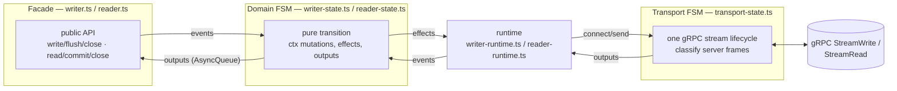
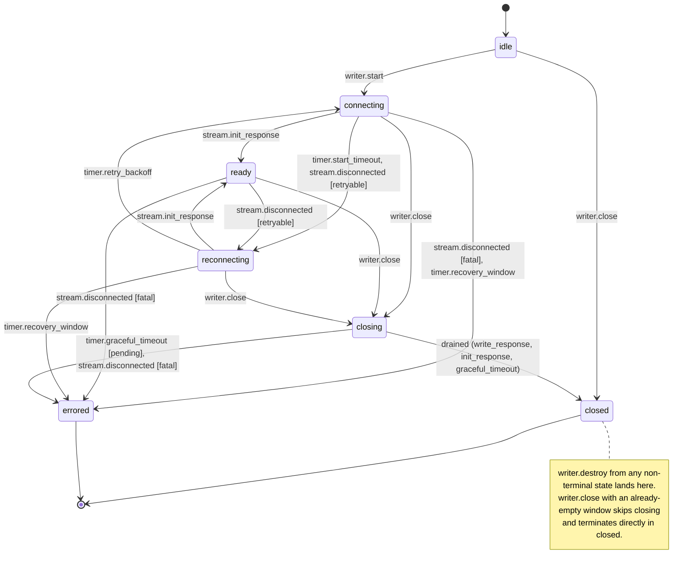
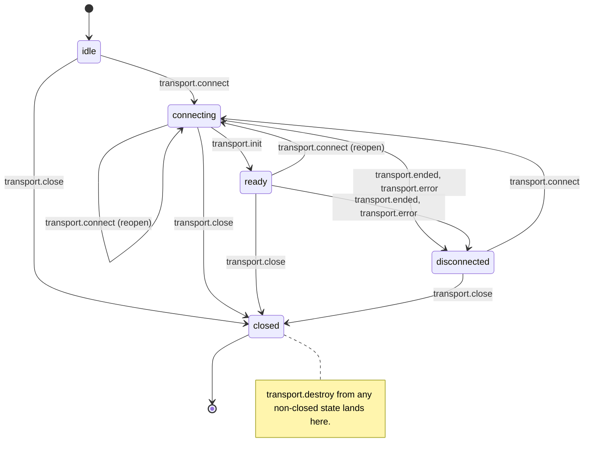
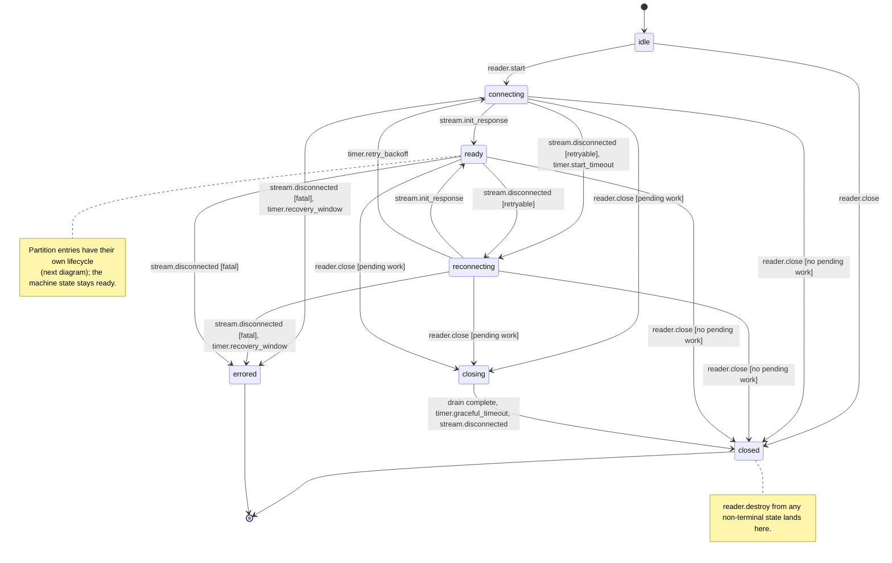
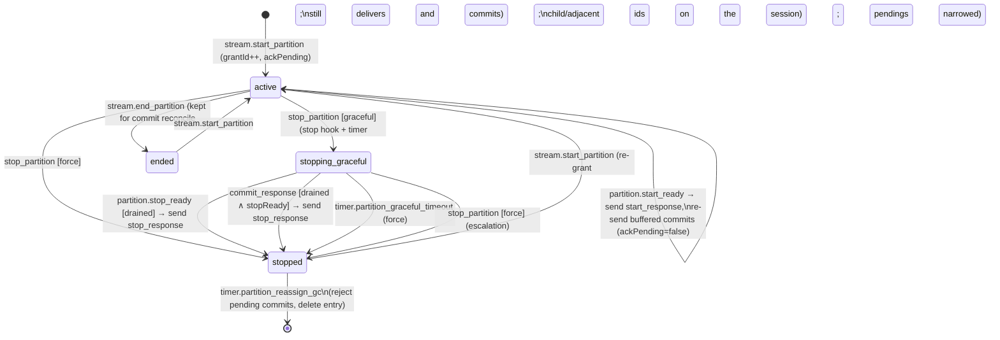

# @ydbjs/topic — state machine maps

Contributor documentation. The reader and writer are each built from two finite state
machines on top of `@ydbjs/fsm`, plus a thin public facade. This file is the map of
every machine: states, transitions, timers, and the invariants the design rests on.

The transition tables below mirror the exhaustive `switch` dispatch in the `*-state.ts`
files one-to-one — every `(state, event)` pair is either a table row or falls into the
`(everything else)` row. **When you change a dispatch, update the matching table and
diagram in the same commit.**

## The two-FSM pipeline

```mermaid
flowchart LR
    subgraph facade [Facade — writer.ts / reader.ts]
        API[public API<br/>write/flush/close · read/commit/close]
    end
    subgraph domain [Domain FSM — writer-state.ts / reader-state.ts]
        D[pure transition<br/>ctx mutations, effects, outputs]
    end
    subgraph transport [Transport FSM — transport-state.ts]
        T[one gRPC stream lifecycle<br/>classify server frames]
    end
    G[(gRPC StreamWrite /<br/>StreamRead)]

    API -- events --> D
    D -- outputs (AsyncQueue) --> API
    D -- effects --> R[runtime<br/>writer-runtime.ts / reader-runtime.ts]
    R -- events --> D
    R -- connect/send --> T
    T -- outputs --> R
    T <--> G
```

- The **domain FSM** is pure and synchronous: it mutates `ctx` in place and returns the
  next state plus a list of effects. All I/O lives in the **runtime**, which executes
  effects (connect, send, timers) and feeds results back as events.
- The **transport FSM** owns exactly one physical stream at a time: it classifies raw
  server frames into typed facts and reports stream life/death. Reconnect policy lives
  in the domain FSM, never in the transport.
- Outputs flow to the facade through an `AsyncQueue` with drain-then-throw semantics:
  on a fatal error the queue delivers already-emitted facts (acks, commit confirmations)
  first, then throws the reason.
- Convention: the domain FSMs log deliberately-ignored `(state, event)` pairs via
  `ignored()`; the transport FSMs drop unhandled events silently — they are pure
  classifiers, and every meaningful fact already has an explicit case.

---

## Writer FSM (`writer-state.ts`)

- `idle` — created, not started; accepts writes into the buffer before connecting
- `connecting` — one stream attempt in flight, `start_timeout` watchdog armed
- `ready` — live session; pumps buffer → inflight, handles acks/token
- `reconnecting` — backing off between attempts (`retry_backoff` armed; `recovery_window` armed only if `recoveryWindowMs` is finite)
- `closing` — graceful drain gate, bounded by `graceful_timeout`; keeps reconnecting to finish the drain
- `closed` — graceful/destroyed terminal (final)
- `errored` — fatal terminal (final)

```mermaid
stateDiagram-v2
    [*] --> idle
    idle --> connecting: writer.start
    idle --> closed: writer.close
    connecting --> ready: stream.init_response
    connecting --> reconnecting: timer.start_timeout, stream.disconnected [retryable]
    connecting --> errored: stream.disconnected [fatal], timer.recovery_window
    connecting --> closing: writer.close
    ready --> reconnecting: stream.disconnected [retryable]
    ready --> errored: stream.disconnected [fatal]
    ready --> closing: writer.close
    reconnecting --> ready: stream.init_response
    reconnecting --> connecting: timer.retry_backoff
    reconnecting --> errored: timer.recovery_window
    reconnecting --> closing: writer.close
    closing --> closed: drained (write_response, init_response, graceful_timeout)
    closing --> errored: timer.graceful_timeout [pending], stream.disconnected [fatal]
    closed --> [*]
    errored --> [*]
    note right of closed
        writer.destroy from any non-terminal state lands here.
        writer.close with an already-empty window skips closing
        and terminates directly in closed.
    end note
```

Helper resolution: `toReady` → `ready`; `toReconnecting` → `reconnecting`; `toClosing` →
`closing` (or straight to `closed` via `closeWhenDrained` if the window is already
empty); `terminate(s)` → `s` with `final:{reason}`, emits `writer.closed` (plus
`writer.error` when `errored`), frees the message window, effects `[transport.close,
finalize]`. `pump` keeps the state — effect `send.write_request(batch)` when sendable,
self-dispatches `writer.pump` while more can be sent. `connectEffects` =
`[transport.connect(getLastSeqNo=!hasEverConnected), schedule start_timeout]`.

Flush requests carry increasing `requestId` values; `writer.flushed` echoes the latest processed request so an older output cannot resolve a newer facade waiter. Flush still waits until the entire message window drains.

Each retained message stores its memory-budget cost and its protobuf contribution, including metadata and framing. Both normal acknowledgments and reconnect dedup release the same budget and compact the acknowledged prefix. Diagnostics retain the compressed-payload byte count separately from the memory quota.

The runtime finalizer also runs when the machine signal aborts after an internal fault, releasing the transport, timers, and message window even when no terminal transition completes.

| state            | event                                              | → next                  | key effects / outputs / timers                                                                                                                                                                                                                                                                                                                                                                                                                       |
| ---------------- | -------------------------------------------------- | ----------------------- | ---------------------------------------------------------------------------------------------------------------------------------------------------------------------------------------------------------------------------------------------------------------------------------------------------------------------------------------------------------------------------------------------------------------------------------------------------- |
| any non-terminal | `writer.destroy`                                   | closed                  | terminate: emit `writer.closed{reason ?? 'Writer destroyed'}`; release window                                                                                                                                                                                                                                                                                                                                                                        |
| idle             | `writer.start`                                     | connecting              | `transport.connect(getLastSeqNo=true)`, schedule `start_timeout`                                                                                                                                                                                                                                                                                                                                                                                     |
| idle             | `writer.write`                                     | same                    | enqueue (infers seqNoMode on first message; manual seqNo raises `lastSeqNo` HWM)                                                                                                                                                                                                                                                                                                                                                                     |
| idle             | `writer.close`                                     | closed                  | terminate('Writer closed before start')                                                                                                                                                                                                                                                                                                                                                                                                              |
| idle             | (everything else)                                  | same                    | ignored (logged)                                                                                                                                                                                                                                                                                                                                                                                                                                     |
| connecting       | `writer.write`                                     | same                    | enqueue                                                                                                                                                                                                                                                                                                                                                                                                                                              |
| connecting       | `writer.flush`                                     | same                    | set `flushRequested`; emit `writer.flushed` if window empty                                                                                                                                                                                                                                                                                                                                                                                          |
| connecting       | `writer.stream.init_response`                      | ready / errored         | toReady: codec gate first — a non-empty `supportedCodecs` excluding the session codec terminates `errored` before anything reaches the wire; else `attempts=0`; applyInit (recover seqNo HWM once, dedup server-persisted inflight → emit `writer.acknowledgments{skipped}`; emit `writer.session`); resolve flush if drained; dispatch `writer.pump`; clear `start_timeout`/`retry_backoff`/`recovery_window`; schedule `flush_tick`+`update_token` |
| connecting       | `writer.timer.start_timeout`                       | reconnecting            | toReconnecting(no error)                                                                                                                                                                                                                                                                                                                                                                                                                             |
| connecting       | `writer.stream.disconnected` [retryable]           | reconnecting            | toReconnecting(error): record `lastError`; emit `writer.reconnecting{attempt,error}`; schedule `retry_backoff` (+`recovery_window` if finite)                                                                                                                                                                                                                                                                                                        |
| connecting       | `writer.stream.disconnected` [fatal]               | errored                 | terminate(error): emit `writer.error`+`writer.closed`                                                                                                                                                                                                                                                                                                                                                                                                |
| connecting       | `writer.timer.recovery_window`                     | errored                 | terminate(`lastError ?? 'Writer recovery window expired'`)                                                                                                                                                                                                                                                                                                                                                                                           |
| connecting       | `writer.close`                                     | closing / closed        | toClosing: dispatch `writer.pump`; schedule `graceful_timeout` (start_timeout/retry_backoff left armed)                                                                                                                                                                                                                                                                                                                                              |
| connecting       | (everything else)                                  | same                    | ignored (logged)                                                                                                                                                                                                                                                                                                                                                                                                                                     |
| ready            | `writer.write`                                     | same                    | enqueue; dispatch `writer.pump`                                                                                                                                                                                                                                                                                                                                                                                                                      |
| ready            | `writer.pump` / `writer.timer.flush_tick`          | same                    | pump: form batch (buffer→inflight, assign auto seqNos); `send.write_request`; re-dispatch while sendable                                                                                                                                                                                                                                                                                                                                             |
| ready            | `writer.stream.write_response`                     | same                    | acknowledge acked prefix → emit `writer.acknowledgments{freedBytes}`; emit `writer.flushed` if flush pending and drained; dispatch `writer.pump`                                                                                                                                                                                                                                                                                                     |
| ready            | `writer.flush`                                     | same                    | requestFlush (emit `writer.flushed` if drained, else dispatch `writer.pump`)                                                                                                                                                                                                                                                                                                                                                                         |
| ready            | `writer.timer.update_token`                        | same                    | `send.update_token`                                                                                                                                                                                                                                                                                                                                                                                                                                  |
| ready            | `writer.stream.token_response`                     | same                    | consumed, no-op                                                                                                                                                                                                                                                                                                                                                                                                                                      |
| ready            | `writer.stream.disconnected` [retryable]           | reconnecting            | toReconnecting(error)                                                                                                                                                                                                                                                                                                                                                                                                                                |
| ready            | `writer.stream.disconnected` [fatal]               | errored                 | terminate(error)                                                                                                                                                                                                                                                                                                                                                                                                                                     |
| ready            | `writer.close`                                     | closing / closed        | toClosing                                                                                                                                                                                                                                                                                                                                                                                                                                            |
| ready            | (everything else)                                  | same                    | ignored (logged)                                                                                                                                                                                                                                                                                                                                                                                                                                     |
| reconnecting     | `writer.write`                                     | same                    | enqueue                                                                                                                                                                                                                                                                                                                                                                                                                                              |
| reconnecting     | `writer.flush`                                     | same                    | requestFlush                                                                                                                                                                                                                                                                                                                                                                                                                                         |
| reconnecting     | `writer.stream.init_response`                      | ready                   | toReady (late init from a still-open stream is honored)                                                                                                                                                                                                                                                                                                                                                                                              |
| reconnecting     | `writer.timer.retry_backoff`                       | connecting              | `attempts += 1`; connectEffects                                                                                                                                                                                                                                                                                                                                                                                                                      |
| reconnecting     | `writer.timer.recovery_window`                     | errored                 | terminate(`lastError ?? 'Writer recovery window expired'`)                                                                                                                                                                                                                                                                                                                                                                                           |
| reconnecting     | `writer.stream.disconnected`                       | same                    | record `lastError` if present; stay (already backing off)                                                                                                                                                                                                                                                                                                                                                                                            |
| reconnecting     | `writer.close`                                     | closing / closed        | toClosing                                                                                                                                                                                                                                                                                                                                                                                                                                            |
| reconnecting     | (everything else)                                  | same                    | ignored (logged)                                                                                                                                                                                                                                                                                                                                                                                                                                     |
| closing          | `writer.stream.write_response`                     | closed [drained] / same | acknowledge → emits as in ready; closeWhenDrained: terminate('Writer closed') when window empty, else dispatch `writer.pump`                                                                                                                                                                                                                                                                                                                         |
| closing          | `writer.pump` / `flush_tick` [`!hasEverConnected`] | same                    | no-op guard: never assign auto seqNos before the HWM is recovered (prevents dedup data loss when close() races the first init)                                                                                                                                                                                                                                                                                                                       |
| closing          | `writer.pump` / `flush_tick` [`hasEverConnected`]  | same                    | pump                                                                                                                                                                                                                                                                                                                                                                                                                                                 |
| closing          | `writer.flush`                                     | same                    | requestFlush                                                                                                                                                                                                                                                                                                                                                                                                                                         |
| closing          | `writer.stream.init_response`                      | closed [drained] / same | applyInit; resolve flush; closeWhenDrained; clear `start_timeout`                                                                                                                                                                                                                                                                                                                                                                                    |
| closing          | `writer.timer.retry_backoff`                       | same                    | connectEffects — keeps draining over a fresh stream                                                                                                                                                                                                                                                                                                                                                                                                  |
| closing          | `writer.timer.graceful_timeout` [not drained]      | errored                 | terminate('Graceful shutdown timed out with undelivered messages') — close() rejects instead of dropping writes                                                                                                                                                                                                                                                                                                                                      |
| closing          | `writer.timer.graceful_timeout` [drained]          | closed                  | closeWhenDrained → terminate('Writer closed')                                                                                                                                                                                                                                                                                                                                                                                                        |
| closing          | `writer.timer.start_timeout`                       | same                    | clear `start_timeout`, schedule `retry_backoff`                                                                                                                                                                                                                                                                                                                                                                                                      |
| closing          | `writer.stream.disconnected` [retryable]           | same                    | clear `start_timeout`, schedule `retry_backoff`                                                                                                                                                                                                                                                                                                                                                                                                      |
| closing          | `writer.stream.disconnected` [fatal]               | errored                 | terminate(error)                                                                                                                                                                                                                                                                                                                                                                                                                                     |
| closing          | (everything else)                                  | same                    | ignored (logged)                                                                                                                                                                                                                                                                                                                                                                                                                                     |
| closed / errored | (everything, incl. `writer.destroy`)               | same                    | ignored (logged)                                                                                                                                                                                                                                                                                                                                                                                                                                     |

Retryable classification (`isRetryableWriterError`): a clean end (no error) is
retryable; payload-too-large (`ClientError RESOURCE_EXHAUSTED` + `/larger than/i`) is
always fatal; `SCHEME_ERROR` is retryable only with `retryOnSchemeError`; otherwise
`isRetryableStreamError || isRetryableError(err, idempotent=true)` — writes are
idempotent (producerId+seqNo dedup), so the conditionally-retryable YDB statuses retry.

## Writer transport FSM (`writer/transport-state.ts`)

- `idle` — created, no stream yet
- `connecting` — `open_stream` issued, awaiting init (one physical streamWrite lifecycle)
- `ready` — init seen; forwarding classified stream facts as outputs
- `disconnected` — stream ended/errored; awaiting `transport.connect` (reopen) or `transport.close`
- `closed` — terminal (final)

```mermaid
stateDiagram-v2
    [*] --> idle
    idle --> connecting: transport.connect
    idle --> closed: transport.close
    connecting --> ready: transport.init
    connecting --> connecting: transport.connect (reopen)
    connecting --> disconnected: transport.ended, transport.error
    connecting --> closed: transport.close
    ready --> connecting: transport.connect (reopen)
    ready --> disconnected: transport.ended, transport.error
    ready --> closed: transport.close
    disconnected --> connecting: transport.connect
    disconnected --> closed: transport.close
    closed --> [*]
    note right of closed
        transport.destroy from any non-closed state lands here.
    end note
```

| state              | event                                 | → next       | key effects / outputs                                                   |
| ------------------ | ------------------------------------- | ------------ | ----------------------------------------------------------------------- |
| any non-closed     | `transport.destroy`                   | closed       | `close_stream`, `finalize(reason ?? 'Transport destroyed')`             |
| idle               | `transport.connect`                   | connecting   | `open_stream`                                                           |
| idle               | `transport.close`                     | closed       | `finalize('Transport closed')` (nothing open — no `close_stream`)       |
| connecting / ready | `transport.connect`                   | connecting   | `open_stream` (reopen; disposes the previous stream first)              |
| connecting / ready | `transport.init`                      | ready / same | emit `transport.stream.init_response{sessionId,lastSeqNo,partitionId?}` |
| connecting / ready | `transport.write`                     | same         | emit `transport.stream.write_response{acks}`                            |
| connecting / ready | `transport.token`                     | same         | emit `transport.stream.token_response`                                  |
| connecting / ready | `transport.ended` / `transport.error` | disconnected | emit `transport.stream.disconnected{error?}`; `close_stream`            |
| connecting / ready | `transport.close`                     | closed       | `close_stream`, `finalize('Transport closed')`                          |
| disconnected       | `transport.connect`                   | connecting   | `open_stream`                                                           |
| disconnected       | `transport.close`                     | closed       | `finalize('Transport closed')`                                          |
| any                | (everything else)                     | same         | silently dropped (pure classifier)                                      |

---

### Flush request correlation

`requestId` numbers `flush()` calls within one writer. It is internal, is never sent to YDB, and is unrelated to message `seqNo`. The facade registers a promise before dispatching the request; the FSM completes it through an asynchronous output queue.

Consider `first = writer.flush(); writer.write(payload); second = writer.flush()` on an empty writer. The FSM can emit the first completion before the write, while the facade consumes that completion after the second call has already registered. Resolving all current waiters would incorrectly complete `second` before the payload's ACK.

A completion carries the highest flush ID processed by the FSM. The facade resolves only IDs up to that value. Several calls waiting on the same drain may share one completion, but an old queued completion cannot resolve a newer call. Automatic message seqNos cannot identify these calls because buffered messages are numbered only when sent.

## Reader FSM (`reader-state.ts`)

- `idle` — initial; only `reader.start` / `reader.close` are meaningful
- `connecting` — stream being opened; `start_timeout` armed
- `ready` — live stream. No seqNo recovery (unlike the writer) — the server re-sends `start_partition` per partition, and commit reconcile happens there
- `reconnecting` — backoff between attempts; `retry_backoff` armed, `recovery_window` only when finite
- `closing` — `close()` drain of pending work (pending commits / stopping-graceful partitions), bounded by `graceful_timeout`
- `closed` — terminal (clean close or destroy)
- `errored` — terminal (non-retryable stream error or recovery-window expiry)

```mermaid
stateDiagram-v2
    [*] --> idle
    idle --> connecting: reader.start
    idle --> closed: reader.close
    connecting --> ready: stream.init_response
    reconnecting --> ready: stream.init_response
    connecting --> reconnecting: stream.disconnected [retryable], timer.start_timeout
    reconnecting --> connecting: timer.retry_backoff
    connecting --> errored: stream.disconnected [fatal], timer.recovery_window
    reconnecting --> errored: stream.disconnected [fatal], timer.recovery_window
    ready --> reconnecting: stream.disconnected [retryable]
    ready --> errored: stream.disconnected [fatal]
    connecting --> closing: reader.close [pending work]
    reconnecting --> closing: reader.close [pending work]
    ready --> closing: reader.close [pending work]
    connecting --> closed: reader.close [no pending work]
    reconnecting --> closed: reader.close [no pending work]
    ready --> closed: reader.close [no pending work]
    closing --> closed: drain complete, timer.graceful_timeout, stream.disconnected
    closed --> [*]
    errored --> [*]
    note right of closed
        reader.destroy from any non-terminal state lands here.
    end note
    note right of ready
        Partition entries have their own lifecycle
        (next diagram); the machine state stays ready.
    end note
```

Per-partition entry lifecycle (inside `ctx.partitions`, keyed by the **stable**
`partitionKey(topicPath, partitionId)` — partition ids alone collide across the
topics of a multi-topic reader; the ephemeral `partitionSessionId → partitionKey`
mapping lives in `ctx.sessionIndex` and is cleared on every reconnect):

```mermaid
stateDiagram-v2
    [*] --> active: stream.start_partition (grantId++, ackPending)
    active --> active: partition.start_ready → send start_response,\nre-send buffered commits (ackPending=false)
    active --> stopping_graceful: stop_partition [graceful] (stop hook + timer;\nstill delivers and commits)
    active --> stopped: stop_partition [force]
    stopping_graceful --> stopped: partition.stop_ready [drained] → send stop_response
    stopping_graceful --> stopped: commit_response [drained ∧ stopReady] → send stop_response
    stopping_graceful --> stopped: timer.partition_graceful_timeout (force)
    stopping_graceful --> stopped: stop_partition [force] (escalation)
    active --> ended: stream.end_partition (kept for commit reconcile;\nchild/adjacent ids on the session)
    stopped --> active: stream.start_partition (re-grant; pendings narrowed)
    ended --> active: stream.start_partition
    stopped --> [*]: timer.partition_reassign_gc\n(reject pending commits, delete entry)
```

The graceful stop is the protocol's soft-stop window: the entry keeps delivering
buffered data and accepting commits while the async `onPartitionSessionStop` hook
runs (effect `partition.stop_hook` → event `partition.stop_ready`, guarded by
`grantId` like the start handshake); the stop response goes out only once the hook
completed AND the pending commits drained — bounded by the per-partition timeout.

Helper resolution: `terminate(s, reason)` → `s` with `final:{reason}`; emits
`reader.error` (when `errored`), `reader.commit.rejected` for every pending commit,
`reader.closed`; clears ctx; effects `transport.close`, clear all timers, `finalize`.
`toReady` → `ready`: `attempts=0`, clear `sessionIndex`, reset `readCreditBytes` while retaining `bufferedBytes`; emits `reader.session`, schedules `update_token`, and grants only the unused buffer budget.
It arms `partition_reassign_gc:key` for every partition holding pending commits.
`toReconnecting(err)` → `reconnecting`: clear `sessionIndex` and `readCreditBytes`, retain `bufferedBytes`; emits `reader.reconnecting` and schedules `retry_backoff` (+`recovery_window` iff finite).
`toClosing` → `closing` iff pending work exists, else terminate(closed, 'Reader closed').
`advanceCommitted(entry, offset)` — the single point where the server-confirmed
committed watermark moves: compacts claimed ranges, lifts `deliveredWatermark`, and
emits `partition.committed{session}` so the observer sees every advance (commit acks,
stop watermarks, partition status responses). A start-response `commitOffset` remains a requested watermark until server confirmation; pending ranges remain available for replay after reconnect. Status queries start after the start response and retry after one second when a response reports a lower watermark. Only one status request is outstanding at a time.

Read flow control tracks retained response bytes across streams as `R = bufferedBytes` and the current stream's unspent credit as `C = readCreditBytes`.
A response adds its server-accounted size to `R` and subtracts it from `C`; an oversized response can make `C` negative.
When `read()` releases a response, `R` decreases in every non-terminal state, but only `ready` sends new credit: `G = max(0, maxBufferBytes - R - C)`, followed by `C += G` and `read_request(G)` when `G > 0`.

`bufferedBytes` counts received responses that the application has not fully consumed; it does not count outgoing writes awaiting ACK. `readCreditBytes` is the current stream's remaining allowance, calculated from its ReadRequests minus ReadResponses. The Topic protocol permits the first message in a response to overdraw this allowance when it does not fit.

For a 1000-byte limit, these two states have the same buffered data but require different replenishment:

| Situation                                          | Buffered bytes | Stream credit |                                 Grant after consuming the response |
| -------------------------------------------------- | -------------: | ------------: | -----------------------------------------------------------------: |
| A 1500-byte response arrives on the current stream |           1500 |          -500 | 1500: repay the 500-byte overdraw and restore the 1000-byte window |
| The same response remains buffered after reconnect |           1500 |             0 |                      1000: the old stream's debt no longer applies |

The buffer size alone cannot distinguish these states. For an ordinary response, receiving bytes transfers capacity from stream credit to the buffer; consuming it transfers capacity back. A reconnect discards only the stream's credit and debt, while the retained responses still occupy the client buffer.

A new stream starts with `C = 0`, so retained responses reduce its initial grant; oversized responses inherited from an old stream can withhold that grant entirely until the consumer frees space.

| state                     | event                                                                                                                    | → next                           | key effects / outputs / timers                                                                                                                                                                                                                                                                                                                                                                                                                                                                                                              |
| ------------------------- | ------------------------------------------------------------------------------------------------------------------------ | -------------------------------- | ------------------------------------------------------------------------------------------------------------------------------------------------------------------------------------------------------------------------------------------------------------------------------------------------------------------------------------------------------------------------------------------------------------------------------------------------------------------------------------------------------------------------------------------- |
| any non-terminal          | `reader.destroy`                                                                                                         | closed                           | terminate(closed, `reason ?? 'Reader destroyed'`)                                                                                                                                                                                                                                                                                                                                                                                                                                                                                           |
| any non-terminal          | `reader.read_release`                                                                                                    | same                             | `bufferedBytes -= bytes` (floor 0); only in `ready`, grant positive `maxBufferBytes - bufferedBytes - readCreditBytes` and add it to `readCreditBytes`; no wire request while connecting, reconnecting or closing                                                                                                                                                                                                                                                                                                                           |
| idle                      | `reader.start`                                                                                                           | connecting                       | `transport.connect`, schedule `start_timeout`                                                                                                                                                                                                                                                                                                                                                                                                                                                                                               |
| idle                      | `reader.close`                                                                                                           | closed                           | terminate(closed, 'Reader closed before start')                                                                                                                                                                                                                                                                                                                                                                                                                                                                                             |
| idle                      | (everything else)                                                                                                        | same                             | ignored (logged)                                                                                                                                                                                                                                                                                                                                                                                                                                                                                                                            |
| connecting / reconnecting | `reader.stream.init_response`                                                                                            | ready                            | toReady                                                                                                                                                                                                                                                                                                                                                                                                                                                                                                                                     |
| connecting / reconnecting | `reader.commit`                                                                                                          | same                             | recordCommit: buffer only (never sends outside ready); `commit.rejected` if partition unknown, `commit.resolved` if ranges already covered                                                                                                                                                                                                                                                                                                                                                                                                  |
| connecting / reconnecting | `reader.stream.disconnected` [fatal]                                                                                     | errored                          | terminate(errored, error)                                                                                                                                                                                                                                                                                                                                                                                                                                                                                                                   |
| connecting / reconnecting | `reader.stream.disconnected` [retryable], `timer.start_timeout`                                                          | reconnecting                     | toReconnecting                                                                                                                                                                                                                                                                                                                                                                                                                                                                                                                              |
| connecting / reconnecting | `timer.retry_backoff` [state==reconnecting]                                                                              | connecting                       | `attempts+=1`; `transport.connect`, schedule `start_timeout`                                                                                                                                                                                                                                                                                                                                                                                                                                                                                |
| connecting / reconnecting | `timer.retry_backoff` [state==connecting]                                                                                | same                             | ignored (stale backoff, logged)                                                                                                                                                                                                                                                                                                                                                                                                                                                                                                             |
| connecting / reconnecting | `timer.recovery_window`                                                                                                  | errored                          | terminate(errored, `lastError ?? 'Reader recovery window expired'`)                                                                                                                                                                                                                                                                                                                                                                                                                                                                         |
| connecting / reconnecting | `timer.partition_graceful_timeout`                                                                                       | same                             | forceStopStalledGraceful: entry→`stopped`, emit `partition.stopped(graceful)`; `stop_response` only if the session id belongs to the current stream; arm `partition_reassign_gc:pid` if pendings remain                                                                                                                                                                                                                                                                                                                                     |
| connecting / reconnecting | `timer.partition_reassign_gc`                                                                                            | same                             | gcPartition: reject pending commits, delete entry unless it is a granted-but-unacked current grant; no-op if live+acked                                                                                                                                                                                                                                                                                                                                                                                                                     |
| connecting / reconnecting | `reader.close`                                                                                                           | closing / closed                 | toClosing                                                                                                                                                                                                                                                                                                                                                                                                                                                                                                                                   |
| connecting / reconnecting | (everything else)                                                                                                        | same                             | ignored (logged)                                                                                                                                                                                                                                                                                                                                                                                                                                                                                                                            |
| ready                     | `reader.stream.read_response`                                                                                            | same                             | charge `bufferedBytes += bytesSize`, consume `readCreditBytes -= bytesSize`; stitch each message's `commitRangeStart` from `deliveredWatermark`; emit one `reader.messages{releaseBytes, groups}` (drops data of unknown/superseded/stopped/ended entries — `stopping-graceful` still delivers; emitted even when all dropped so the credit is released)                                                                                                                                                                                    |
| ready                     | `reader.stream.start_partition`                                                                                          | same                             | upsert entry (key = topicPath+partitionId): →`active`, new `grantId`, `ackPending=true`, fresh session id (old id dropped from index); `deliveredWatermark`/claims restart at `committedOffset`; narrow pendings' ranges to it (resolve emptied); clear `partition_graceful_timeout:key`; emit `partition.started`; effect `partition.start_hook` (response deferred to `start_ready`)                                                                                                                                                      |
| ready                     | `reader.stream.stop_partition` [force]                                                                                   | same                             | advance committed (emit `partition.committed` if it moved) + resolve covered commits; entry→`stopped`, emit `partition.stopped(lost)`; clear `partition_graceful_timeout:key`; arm `partition_reassign_gc:key` if pendings remain                                                                                                                                                                                                                                                                                                           |
| ready                     | `reader.stream.stop_partition` [graceful]                                                                                | same                             | advance committed (emit `partition.committed` if it moved) + resolve covered commits; entry→`stopping-graceful` (still delivers/commits); effect `partition.stop_hook`; arm `partition_graceful_timeout:key`                                                                                                                                                                                                                                                                                                                                |
| ready                     | `reader.stream.commit_response`                                                                                          | same                             | advance committed offsets (compact claimed ranges); emit `partition.committed` + `commit.resolved` for drained waiters; a drained `stopping-graceful` entry with `stopReady` →`stopped`: emit `partition.stopped(graceful)`, send `stop_response`, clear `partition_graceful_timeout:key`                                                                                                                                                                                                                                                   |
| ready / closing           | `reader.stream.partition_status`                                                                                         | same / closed [closing, drained] | confirm server watermark like a commit response; schedule `partition_commit_status:key` only when the override is still unconfirmed; ignore retired sessions                                                                                                                                                                                                                                                                                                                                                                                |
| ready / closing           | `timer.partition_commit_status`                                                                                          | same                             | request status only for a live grant with an unconfirmed override; regrant, disconnect and stop clear its timer                                                                                                                                                                                                                                                                                                                                                                                                                             |
| ready                     | `reader.stream.end_partition`                                                                                            | same                             | entry→`ended`, session records child/adjacent partition ids, emit `partition.stopped(ended)`; no response; entry + session index kept so commits still reach the wire                                                                                                                                                                                                                                                                                                                                                                       |
| ready                     | `reader.commit`                                                                                                          | same                             | recordCommit: clamp the facade's ranges to server committed, subtract claimed coverage (an overlap on the wire is session-fatal); fully covered → immediate `commit.resolved`; uncovered remainder on a `stopped` entry → immediate `commit.rejected` (the commit lost the race with the partition stop — never parked on the gc); else buffer pending + claim; `send.commit` only if the session is live on the current stream AND entry is `active`/`stopping-graceful`/`ended` AND `!ackPending`; `commit.rejected` when no entry exists |
| ready                     | `reader.partition.start_ready`                                                                                           | same                             | ackPartitionStart: no-op if grantId stale / not ackPending / not active / not indexed; else `ackPending=false`, `commitOffset` override sets the requested floor without confirming commits; effects `send.start_response`, clear `partition_reassign_gc:key`, re-send pending ranges above the requested floor, request partition status for an unconfirmed override                                                                                                                                                                       |
| ready                     | `reader.partition.stop_ready`                                                                                            | same                             | ackPartitionStop: no-op if grantId stale / not `stopping-graceful`; else `stopReady=true`; when drained →`stopped`: emit `partition.stopped(graceful)`, send `stop_response` (only over the granting stream), clear `partition_graceful_timeout:key`                                                                                                                                                                                                                                                                                        |
| ready                     | `timer.update_token`                                                                                                     | same                             | `send.update_token`                                                                                                                                                                                                                                                                                                                                                                                                                                                                                                                         |
| ready                     | `timer.partition_reassign_gc` / `timer.partition_graceful_timeout`                                                       | same                             | gcPartition / forceStopStalledGraceful (as above)                                                                                                                                                                                                                                                                                                                                                                                                                                                                                           |
| ready                     | `reader.stream.disconnected` [fatal]                                                                                     | errored                          | terminate(errored, error)                                                                                                                                                                                                                                                                                                                                                                                                                                                                                                                   |
| ready                     | `reader.stream.disconnected` [retryable]                                                                                 | reconnecting                     | toReconnecting(error)                                                                                                                                                                                                                                                                                                                                                                                                                                                                                                                       |
| ready                     | `reader.close`                                                                                                           | closing / closed                 | toClosing                                                                                                                                                                                                                                                                                                                                                                                                                                                                                                                                   |
| ready                     | (everything else)                                                                                                        | same                             | ignored (logged)                                                                                                                                                                                                                                                                                                                                                                                                                                                                                                                            |
| closing                   | `stream.read_response` / `start_partition` / `stop_partition` / `commit_response` / `partition_status` / `end_partition` | closed [drained] / same          | applyStreamEvent (same per-event handling as in ready); then terminate(closed, 'Reader closed') once no pending work                                                                                                                                                                                                                                                                                                                                                                                                                        |
| closing                   | `reader.partition.start_ready`                                                                                           | same                             | ackPartitionStart (a start honored during the drain still gets answered)                                                                                                                                                                                                                                                                                                                                                                                                                                                                    |
| closing                   | `reader.partition.stop_ready`                                                                                            | closed [drained] / same          | ackPartitionStop; a completed stop hook may finish the drain and with it the close                                                                                                                                                                                                                                                                                                                                                                                                                                                          |
| closing                   | `timer.partition_graceful_timeout`                                                                                       | closed [drained] / same          | forceStopStalledGraceful; terminate once drained                                                                                                                                                                                                                                                                                                                                                                                                                                                                                            |
| closing                   | `timer.graceful_timeout`                                                                                                 | closed                           | terminate(closed, 'Reader closed')                                                                                                                                                                                                                                                                                                                                                                                                                                                                                                          |
| closing                   | `reader.stream.disconnected`                                                                                             | closed                           | terminate(closed, 'Reader closed') — a drop mid-close abandons un-acked commits                                                                                                                                                                                                                                                                                                                                                                                                                                                             |
| closing                   | `timer.partition_reassign_gc`                                                                                            | closed [drained] / same          | gcPartition; terminate once drained                                                                                                                                                                                                                                                                                                                                                                                                                                                                                                         |
| closing                   | (everything else)                                                                                                        | same                             | ignored (logged)                                                                                                                                                                                                                                                                                                                                                                                                                                                                                                                            |
| closed / errored          | (everything, incl. `reader.destroy`)                                                                                     | same                             | ignored (logged)                                                                                                                                                                                                                                                                                                                                                                                                                                                                                                                            |

## Reader transport FSM (`reader/transport-state.ts`)

Same five states as the writer transport. The only structural difference: after init,
every other server frame is forwarded verbatim as `transport.stream.message` — the
protobuf → domain classification happens in `reader-runtime.ts` (`classifyServerMessage`),
so the reader FSM never touches `serverMessage.case`.

```mermaid
stateDiagram-v2
    [*] --> idle
    idle --> connecting: transport.connect
    idle --> closed: transport.close
    connecting --> ready: transport.init
    connecting --> connecting: transport.connect (reopen)
    connecting --> disconnected: transport.ended, transport.error
    connecting --> closed: transport.close
    ready --> connecting: transport.connect (reopen)
    ready --> disconnected: transport.ended, transport.error
    ready --> closed: transport.close
    disconnected --> connecting: transport.connect
    disconnected --> closed: transport.close
    closed --> [*]
    note right of closed
        transport.destroy from any non-closed state lands here.
    end note
```

| state              | event                                 | → next       | key effects / outputs                                        |
| ------------------ | ------------------------------------- | ------------ | ------------------------------------------------------------ |
| any non-closed     | `transport.destroy`                   | closed       | `close_stream`, `finalize(reason ?? 'Transport destroyed')`  |
| idle               | `transport.connect`                   | connecting   | `open_stream`                                                |
| idle               | `transport.close`                     | closed       | `finalize('Transport closed')`                               |
| connecting / ready | `transport.connect`                   | connecting   | `open_stream` (reopen)                                       |
| connecting / ready | `transport.init`                      | ready / same | emit `transport.stream.init_response{sessionId}`             |
| connecting / ready | `transport.message`                   | same         | emit `transport.stream.message{message}` (verbatim forward)  |
| connecting / ready | `transport.ended` / `transport.error` | disconnected | emit `transport.stream.disconnected{error?}`; `close_stream` |
| connecting / ready | `transport.close`                     | closed       | `close_stream`, `finalize('Transport closed')`               |
| disconnected       | `transport.connect`                   | connecting   | `open_stream`                                                |
| disconnected       | `transport.close`                     | closed       | `finalize('Transport closed')`                               |
| any                | (everything else)                     | same         | silently dropped (pure classifier)                           |

---

## Invariants the maps rest on

1. **seqNo is assigned at send time** (writer, auto mode). Buffered messages carry
   `seqNo=0n` and get numbered in `pump`'s `formBatch` — so a reconnect never renumbers,
   and the `closing` pump gate (`hasEverConnected`) guarantees no auto seqNo is ever
   assigned before the server's high-water mark is recovered.
   Pinned by: writer-state tests, `writer-protocol.test.ts` (live dedup proof).
2. **commit() is never rejected by a transparent reconnect** (reader). Pending commits
   are buffered per partition (keyed by `partitionKey` — path + partitionId, so a
   multi-topic reader's equal partition ids never collide) and their exact remaining
   ranges are re-sent after the start handshake on the new session. A commit racing a stopped partition rejects immediately; pending commits can also reject on the `partition_reassign_gc` timer or terminal shutdown.
   Pinned by: `reader.model.test.ts` (800-seed invariant), `reader.multi-topic.test.ts`.
3. **Grant epoch** (`grantId` + `ackPending` / `stopReady`): a partition grant is live
   only after `start_ready` → `start_response`, and a graceful stop is answered only
   after `stop_ready` + drained commits; buffered commits are sent exactly once, and
   stale hook completions (session ids restart at 1 per stream) can never double-answer.
   Pinned by: reader-state tests, `reader.contract.test.ts` start-handshake tests,
   `reader.partition-lifecycle.test.ts`.
4. **Commit ranges are stitched at delivery time** (`deliveredWatermark` +
   per-message `commitRangeStart`): a server-side offset hole (retention, readFrom
   skip) is attributed to the next delivered message, and a delivered-but-unacked
   message is never covered by another message's commit. `claimedRanges` subtracts
   already-sent coverage, so a zero-width, inverted, or overlapping commit range
   (session-fatal server-side) is unrepresentable.
   Pinned by: `reader.commit-semantics.test.ts`, stitching tests in
   `reader-state.test.ts`, model invariant.
5. **Flow control is charged per ReadResponse** and released exactly once after all messages from that response have passed through `read()` or been discarded for a stopped session. Retained bytes survive reconnects; only stream credit resets. Every grant uses `max(0, maxBufferBytes - bufferedBytes - readCreditBytes)`, so late releases cannot enlarge the new stream's window. Releases during backoff or init affect its initial grant without sending an early request.
6. **Terminal errors throw from the facade, never end streams silently**: the output
   queue drains buffered facts first, then throws (`AsyncQueue.fail`), and every later
   `read()`/`commit()`/`close()` rethrows the same reason.

Cross-checks: the model tests (`*.model.test.ts`) wire these exact transition functions
to a protocol-faithful server model and drive them with 800 random seeds per run; the
contract tests exercise the same maps through the public facade over a fake wire.
