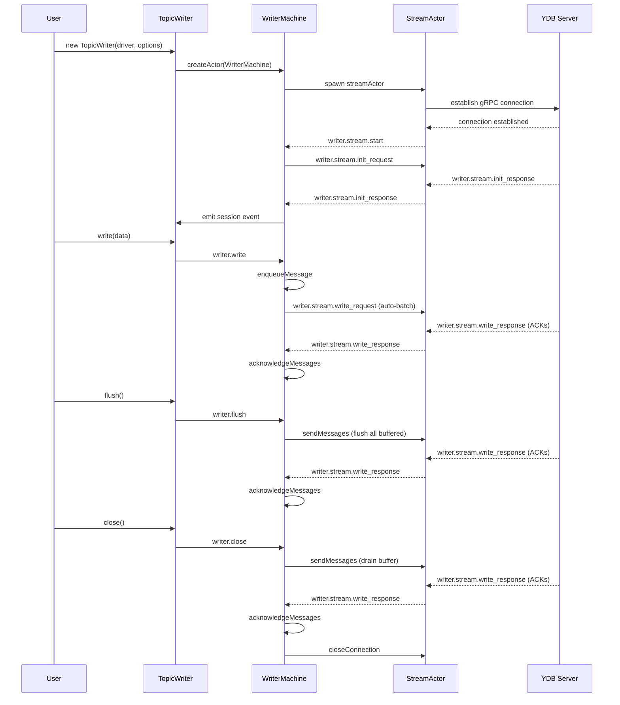
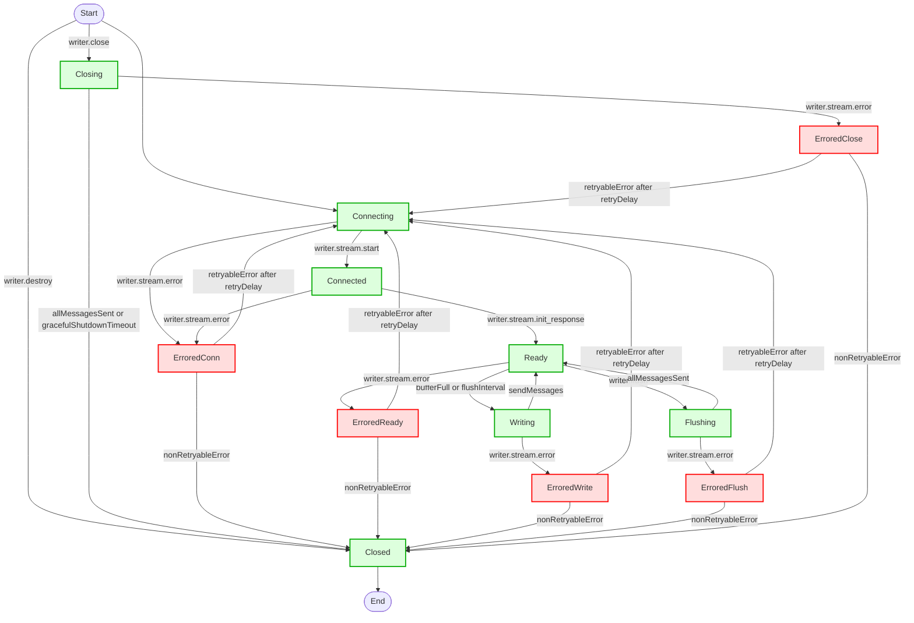

# TopicWriter State Machine (XState 5)

## Purpose

The TopicWriter state machine manages the full lifecycle of a YDB topic writer: connection, batching, flushing, shutdown, and error recovery. It ensures high throughput, safe memory usage, and robust error handling.

## High-Level States

- **connecting**: Establishes gRPC connection to YDB Topic Service
- **connected**: Sends session init request, waits for handshake
- **ready**: Normal operation, accepts writes, auto-batches, background flush
- **writing**: Sends a batch, immediately returns to ready
- **flushing**: User-requested flush, sends all buffered messages, waits for all ACKs
- **closing**: Graceful shutdown, drains all messages, waits for ACKs or timeout
- **errored**: Handles connection errors, retries or closes based on error type
- **closed**: Final state, all resources released

## State Transitions (Happy Path)

## State Transitions (Flowchart)

## Key Actions

- `createConnection`: Spawns StreamActor for gRPC
- `closeConnection`: Stops StreamActor, cleans up
- `createWriteSession`: Sends session init request
- `updateWriteSession`: Stores sessionId, emits session event
- `sendMessages`: Batches and sends messages, updates counters
- `acknowledgeMessages`: Processes ACKs, emits event, releases memory
- `enqueueMessage`: Adds message to buffer, validates size
- `resetAttempts`: Resets retry counter
- `recordError`: Stores last error
- `reportError`: Emits error event for non-retryable errors
- `releaseResources`: Clears all buffers and counters
- `incrementAttempts`: Increments retry counter for backoff

## Guards & Delays

- `bufferFull`: Buffer size > maxBufferBytes
- `allMessagesSent`: Buffer and inflight are empty
- `hasMessagesToSend`: Buffer has messages
- `retryableError`: Error can be retried
- `nonRetryableError`: Error is fatal
- `retryDelay`: Exponential backoff with jitter
- `flushInterval`: Background flush timer
- `gracefulShutdownTimeout`: Max wait for shutdown

## Message Flow (Happy Path)

1. **connect** → `connecting` → `connected` → `ready`
2. **write** → `enqueueMessage` (buffer)
3. **auto-batch** (bufferFull/flushInterval) → `writing` → `sendMessages` → `ready`
4. **ACK** → `acknowledgeMessages`
5. **flush** → `flushing` → wait for allMessagesSent → `ready`
6. **close** → `closing` → drain buffer/inflight → `closed`

## Error Handling

- On error, transition to `errored`, close connection
- If retryable, wait `retryDelay` then reconnect
- If not retryable, report error and close

## Memory Management

- Uses a single array as a sliding window for buffer/inflight/garbage
- Garbage collection triggers when both count and size thresholds are exceeded
- Optionally triggers Node.js GC if enabled

## Configuration Highlights

- `maxBufferBytes`: Buffer size for auto-batching (default: 256MB)
- `maxInflightCount`: Max messages in flight (default: 1000)
- `flushIntervalMs`: Background flush interval (default: 10ms)
- `gracefulShutdownTimeoutMs`: Max shutdown wait (default: 30s)
- `garbageCollection`: Controls memory reclamation

---

For full details, see the code and comments in `machine.ts`.
